# AI 업무도우미

> ITO 담당자의 반복 업무를 **AI 워크플로우**로 자동화해 주는 사내 도우미 플랫폼입니다.
> 본 문서는 **시스템 소개 + 셋업 가이드** 두 파트로 구성되어 있습니다.
> 셋업만 필요하시면 곧장 [§11. 셋업 가이드](#11-셋업-가이드-git-clone--running) 로.

---

## 🚀 Quick Start (Python·Node 깔린 PC, 5분)

```bash
# 1. clone
git clone https://github.com/lyeong-gwa/AI_COWORKER.git
cd AI_COWORKER

# 2. 백엔드
cd backend
python -m venv .venv
. .venv/Scripts/activate                  # PowerShell: .venv\Scripts\Activate.ps1
pip install -r requirements.txt
cp .env.example .env                      # LLM_PROVIDER, OPENAI_API_KEY 등 채움
python scripts/wipe.py --confirm          # DB·ChromaDB 제로 스타트
python -m uvicorn app.main:app --port 8002 --host 0.0.0.0 &

# 3. 프론트엔드 (다른 터미널)
cd ../frontend
npm install
npm run dev -- --port 5174 --strictPort

# 4. 접속
# http://localhost:5174
```

> 자세한 설명·트러블슈팅·폐쇄망 운영은 [§11. 셋업 가이드](#11-셋업-가이드-git-clone--running) 참고.

---

## 1. 시스템 한 줄 요약

> "사용자는 AI 비서(CLI)와 대화하며 업무를 자동화하는 **워크플로우**를 만들고, 웹 화면에서는 그 워크플로우를 **클릭 한 번으로 실행**하고 **결과를 확인**합니다."

- **만드는 사람** : AI 비서(CLI). 업무 흐름을 듣고 워크플로우를 조립해 줍니다.
- **쓰는 사람** : 현업 담당자. 웹 대시보드에서 버튼을 눌러 실행하고, 결과 보고서를 받습니다.
- **자동화되는 것** : Jira/Confluence/메신저 조회, GitHub PR 코드리뷰, 문의 답변, 보고서 생성 같이 "자료 모아서 → AI가 가공 → 결과 정리"로 이어지는 업무들.

---

## 2. 첫인상 — 대시보드

웹에 접속하면 가장 먼저 보이는 화면입니다. 이 시스템에 등록된 자동화 업무들의 **현황판** 역할을 합니다.

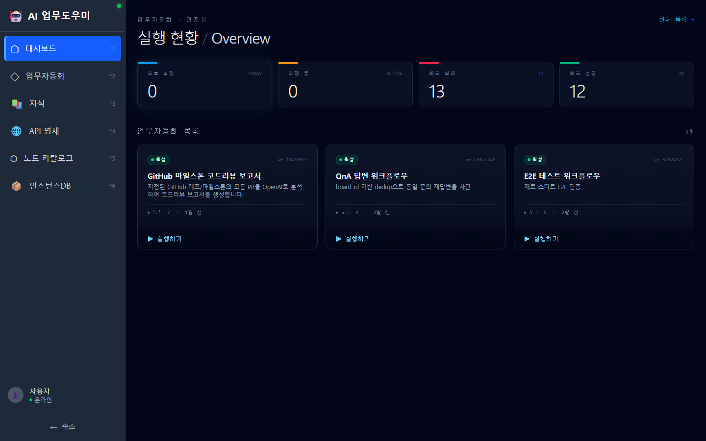

- 좌측에는 **대시보드 / 업무자동화 / 지식 / API 명세 / 노드 카탈로그 / 인스턴스DB** 6개 메뉴가 늘 보입니다.
- 상단 4장의 카드는 **오늘 실행 / 진행 중 / 최근 실패 / 최근 성공** 건수를 한눈에 알려 줍니다.
- 그 아래는 등록된 자동화 카드들. 각 카드에 **▶ 실행하기** 버튼이 붙어 있어 곧바로 돌릴 수 있습니다.

---

## 3. 업무자동화 목록

좌측 메뉴 "업무자동화"를 누르면 등록된 자동화 작업의 전체 목록을 볼 수 있습니다.

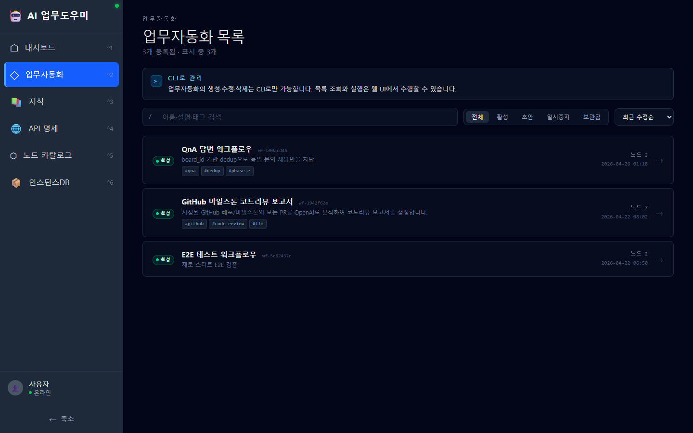

- 상단의 안내 배너가 강조하듯, **생성·수정·삭제는 AI 비서(CLI)** 가 전담합니다. 웹에서는 **목록 조회와 실행만** 가능합니다.
- 검색창과 상태 필터(전체/활성/초안/일시중지/보관됨), 정렬 옵션이 있어 자동화가 늘어나도 빠르게 찾을 수 있습니다.
- 카드에는 워크플로우의 이름·설명·태그·노드 수·최종 수정 시각이 표시됩니다.

---

## 4. 워크플로우 뷰어 — "이 자동화는 어떻게 돌아가지?"

목록의 카드를 클릭하면 그 자동화의 **전체 실행 흐름**을 다이어그램으로 보여줍니다.

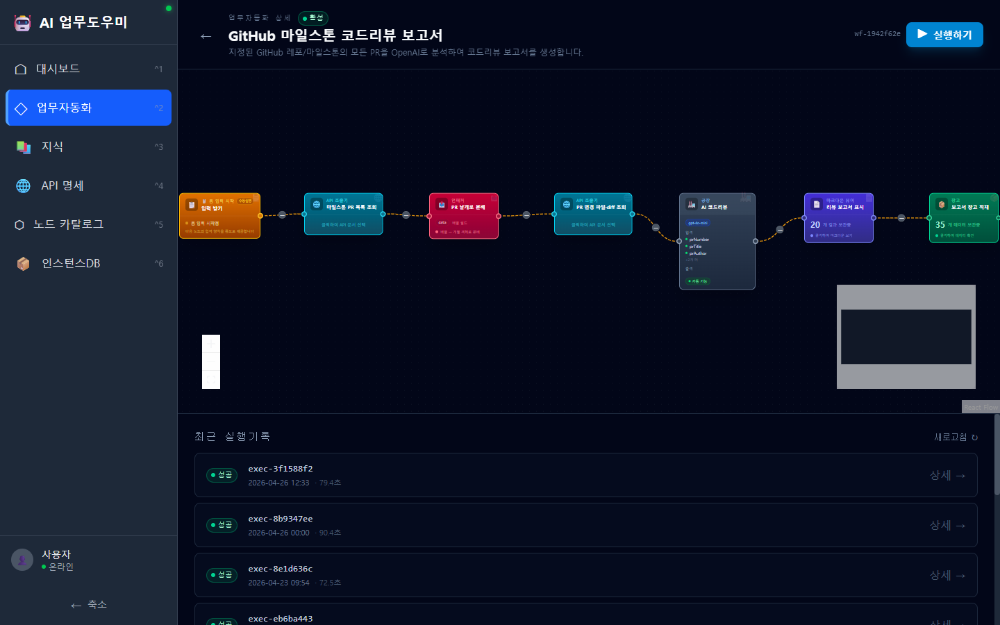

- 노드(블록)들이 좌→우로 이어진 그림이 곧 이 자동화의 "공정도"입니다. 위 예시는 *GitHub 마일스톤 코드리뷰 보고서*로,
  **입력 받기 → 마일스톤 PR 목록 조회 → PR을 낱개로 분배 → 각 PR의 변경 파일·diff 조회 → AI 코드리뷰 → 리뷰 보고서 표시 → 창고 적재** 순으로 흐릅니다.
- 각 노드는 색상과 아이콘으로 종류를 구분합니다 (트리거/AI/로직/액션/출력).
- 우측 상단의 **▶ 실행하기** 버튼이 이 워크플로우를 즉시 시작합니다.
- 화면 하단에는 **최근 실행기록**이 시간 순으로 누적되어 있어, 과거 결과로 바로 들어갈 수 있습니다.

---

## 5. 실행하기 — 클릭 한 번으로 시작

▶ 실행하기 버튼을 누르면 그 워크플로우가 필요로 하는 입력값을 묻는 **간단한 폼**이 떠오릅니다.

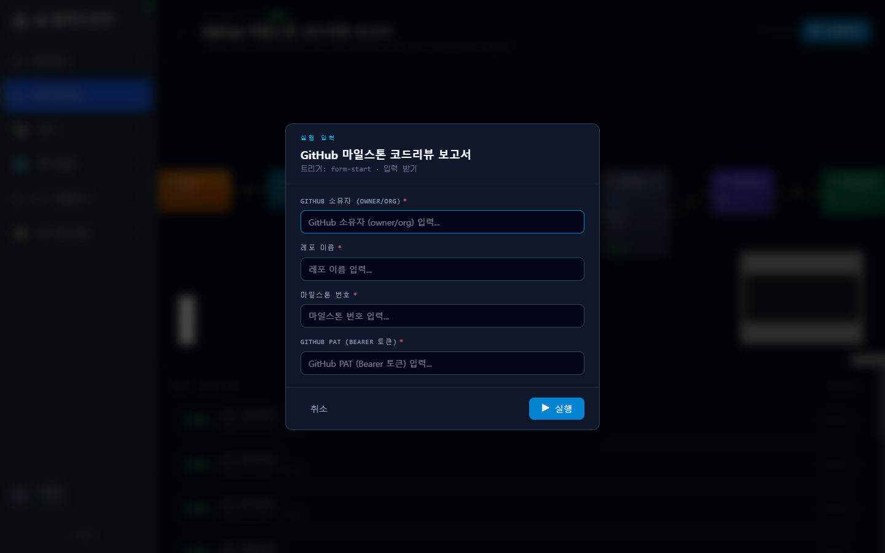

- 폼의 항목은 사람이 직접 만든 것이 아니라, 워크플로우의 시작 노드(`form-start`)가 자동으로 그려 줍니다.
- 위 예시에서는 GitHub 코드리뷰 자동화를 돌리기 위해 **소유자 / 레포 / 마일스톤 번호 / GitHub 토큰** 만 입력하면 됩니다.
- "실행" 버튼을 누른 순간부터는 백그라운드에서 자동으로 동작하므로, 사용자는 다른 일을 하다가 결과만 확인하면 됩니다.

---

## 6. 실행 추적 — 인스턴스 상세

실행을 시작하면 곧바로 **인스턴스 상세 화면**으로 이동합니다. 여기서는 한 번의 실행이 어디까지 진행됐는지를 실시간으로 볼 수 있습니다.

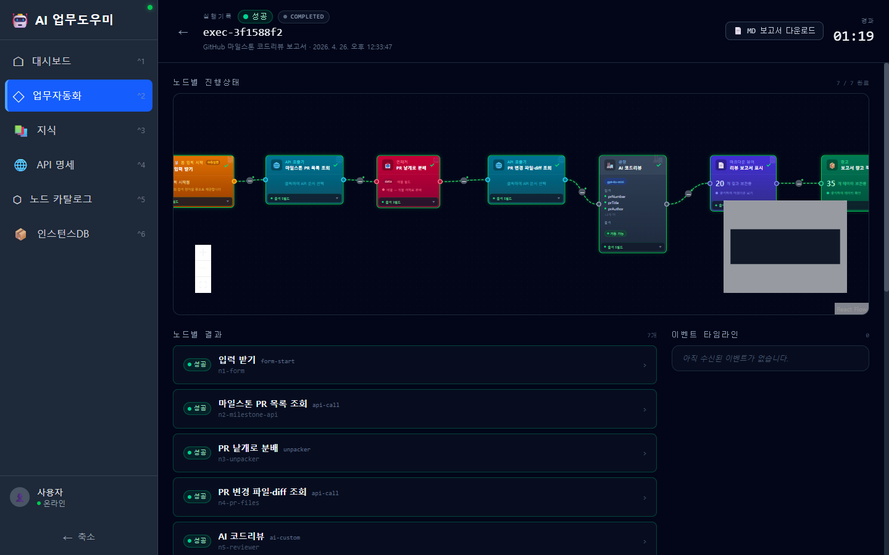

- 상단에는 **성공/실패 상태 배지**, **경과 시간**, **MD 보고서 다운로드** 버튼이 있습니다.
- 가운데 다이어그램은 워크플로우 뷰어와 동일하지만, **각 노드가 끝났는지(✓)·진행 중인지·실패했는지**가 색상으로 표시됩니다.
- 아래 **노드별 결과** 섹션은 노드 단위로 펼쳐서 입력·출력·로그를 확인할 수 있는 패널입니다.
- 우측 **이벤트 타임라인**은 실행 중 발생하는 사건들을 실시간으로 받아 줍니다.

### 6-1. 노드 출력 펼치기

각 노드 카드를 클릭하면 그 노드가 만들어 낸 **실제 출력 데이터**가 펼쳐집니다.

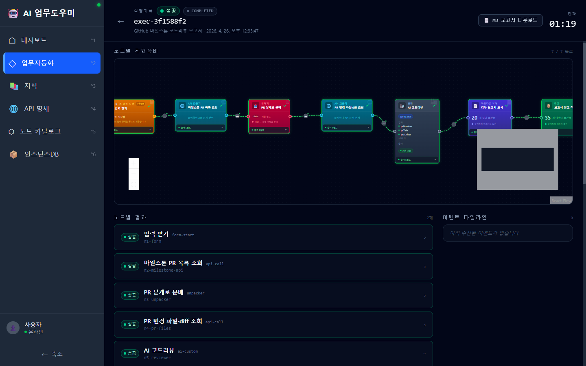

- 위 화면에서 *AI 코드리뷰* 노드를 펼치자, 이 단계에서 만들어진 **마크다운 형식의 코드리뷰 보고서**가 그대로 보입니다.
- "JSON 열기" 버튼으로 원본 데이터 구조를 확인할 수도 있습니다.

### 6-2. 결과창고 — 누적 산출물

실행 결과 중 **저장 대상**으로 지정된 항목은 화면 하단의 **결과창고**에 자동으로 적재됩니다.

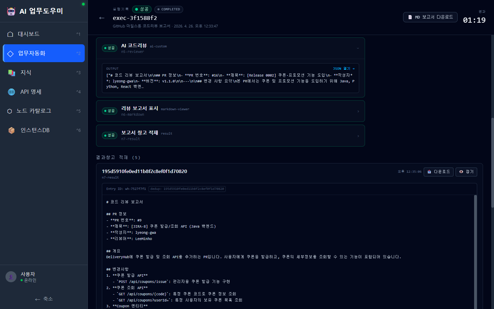

- 항목별로 **다운로드(MD 파일)** 와 **👁️ 미리보기** 버튼이 붙어 있습니다.
- 미리보기를 누르면 화면 안에서 바로 보고서가 마크다운으로 렌더링됩니다. 위 예시는 GitHub PR 한 건에 대한 AI 코드리뷰 보고서입니다.
- 이렇게 누적된 결과물은 나중에 "지식 문서"로 승격해 다음 자동화의 참고 자료로 재사용할 수 있습니다.

---

## 7. 보조 화면 — 자동화의 재료들

워크플로우 한 건은 단독으로 만들어지지 않습니다. **지식 문서 / API 명세 / 노드 / 인스턴스DB** 라는 네 가지 재료가 뒷받침합니다. 웹에서는 이 재료들이 **얼마나·어떻게 등록돼 있는지를 확인**하는 용도로 쓰입니다.

### 7-1. 지식 문서

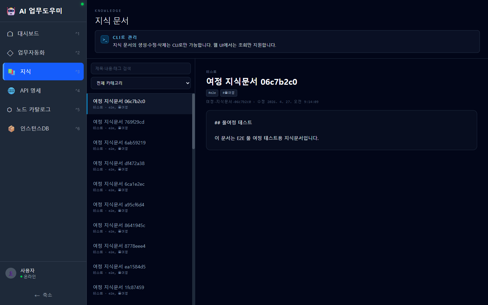

AI가 답변할 때 참고하는 **사내 지식 베이스**입니다. 좌측에 문서 목록, 우측에 본문이 펼쳐지는 2단 구조이며, 검색·카테고리 필터를 지원합니다.

### 7-2. API 명세

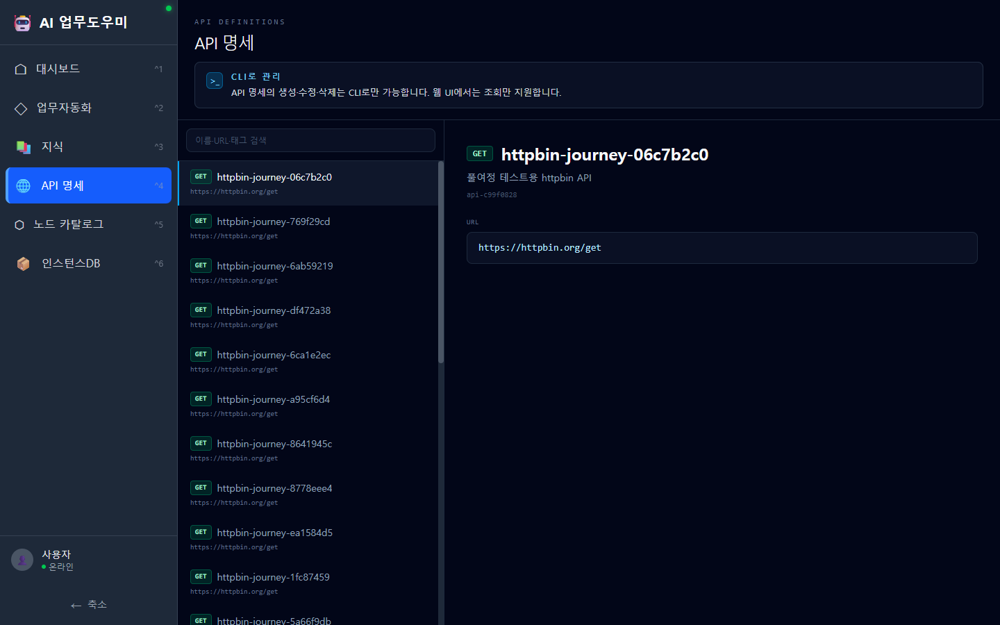

자동화에서 호출할 수 있는 **외부 API 카탈로그**입니다. 메서드(GET/POST 등)와 URL이 카드 형태로 정리돼 있고, 각 명세를 클릭하면 상세가 우측에 표시됩니다.

### 7-3. 노드 카탈로그

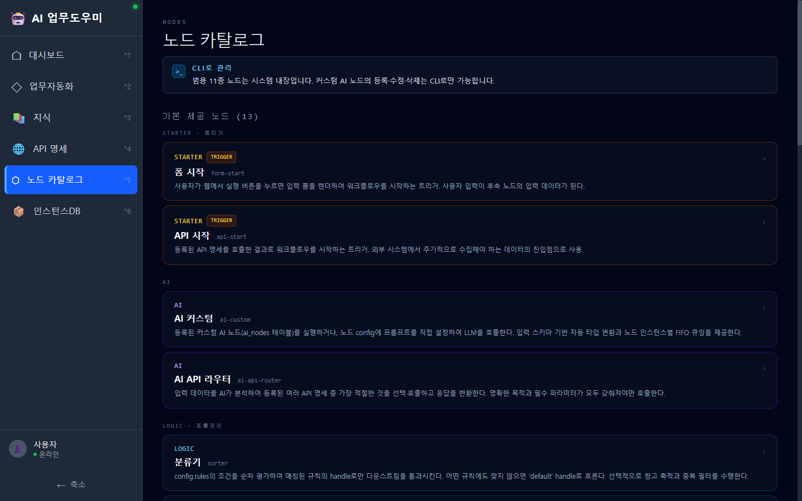

워크플로우를 조립할 때 사용 가능한 **블록 13종**의 설명서입니다. 트리거(STARTER) / AI / 로직(LOGIC) / 액션(ACTION) / 출력(OUTPUT) 카테고리로 묶여 있어, 각 블록이 어떤 역할을 하는지 한 줄 설명과 함께 보여 줍니다.

### 7-4. 인스턴스DB

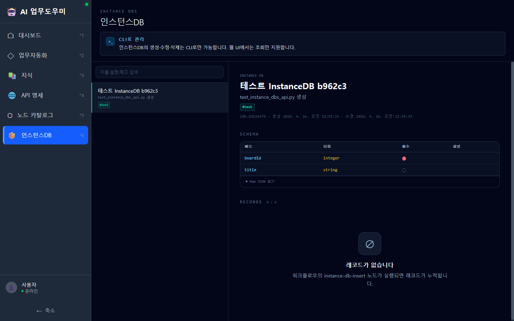

워크플로우가 처리한 데이터를 **표준 스키마로 저장하는 저장소**입니다. 예: "처리한 문의 ID 목록" 같은 식으로, 같은 항목을 두 번 처리하지 않게 막거나 누적 통계를 내는 데 쓰입니다. 화면에서는 등록된 DB의 스키마와 적재된 레코드를 조회할 수 있습니다.

---

## 8. 전체 동작 흐름 한눈에

```
   ┌──────────────────────┐
   │  ① 사용자 ↔ AI 비서(CLI)  │   "이런 업무 자동화하고 싶어"
   └──────────┬───────────┘
              │  (워크플로우/지식/API 명세를 등록)
              ▼
   ┌──────────────────────┐
   │  ② 백엔드 (자동화 엔진)  │   재료를 모아 워크플로우로 조립
   └──────────┬───────────┘
              │
              ▼
   ┌──────────────────────┐
   │  ③ 웹 대시보드          │   ▶ 실행 / 진행 추적 / 결과 보고서
   └──────────────────────┘
```

**핵심 원칙**

1. **만들기는 CLI가, 쓰기는 웹이** — 워크플로우 생성·수정은 AI 비서(CLI)가 책임지고, 웹은 실행과 조회 전용입니다. 화면마다 *"CLI로 관리"* 안내 배너가 그 점을 명시합니다.
2. **클릭 한 번 실행** — 사용자는 폼만 채우면 끝. 이후는 백그라운드에서 자동 진행됩니다.
3. **모든 실행은 추적 가능** — 어떤 입력으로 시작해, 어느 단계에서 무슨 결과가 나왔고, 최종 산출물이 무엇인지 화면 하나에서 확인됩니다.

---

## 9. 현재 진행 상태 (중간 보고 기준)

- ✅ **대시보드 / 업무자동화 / 인스턴스 상세** — 정상 가동 중. 실시간 실행 추적, 마크다운 보고서 미리보기 등 핵심 기능 동작.
- ✅ **지식 문서 / API 명세 / 노드 카탈로그 / 인스턴스DB 뷰어** — 조회 화면 완료.
- ✅ **GitHub 마일스톤 코드리뷰 보고서** — End-to-End 시나리오로 다회 실행 검증 완료(샘플 실행 기록 다수 누적).
- ✅ **QnA 답변 워크플로우 / E2E 테스트 워크플로우** — 부가 시나리오 등록 및 실행 확인.
- 🔧 **CLI 측 워크플로우 조립 도구**는 별도 영역에서 진행 중이며, 본 보고 범위(웹 시스템) 외입니다.

---

## 10. 화면 한 장으로 다시 보기

| # | 화면 | 이미지 |
|---|------|--------|
| 1 | 대시보드 | [01-dashboard.png](docs/images/01-dashboard.png) |
| 2 | 업무자동화 목록 | [02-workflow-list.png](docs/images/02-workflow-list.png) |
| 3 | 워크플로우 뷰어 | [03-workflow-viewer.png](docs/images/03-workflow-viewer.png) |
| 4 | 인스턴스 상세 | [04-instance-detail.png](docs/images/04-instance-detail.png) |
| 5 | 노드 출력 펼치기 | [05-instance-node-detail.png](docs/images/05-instance-node-detail.png) |
| 6 | 결과 보고서 미리보기 | [06-markdown-preview.png](docs/images/06-markdown-preview.png) |
| 7 | 지식 문서 | [07-knowledge.png](docs/images/07-knowledge.png) |
| 8 | API 명세 | [08-api-definitions.png](docs/images/08-api-definitions.png) |
| 9 | 노드 카탈로그 | [09-node-catalog.png](docs/images/09-node-catalog.png) |
| 10 | 인스턴스DB | [10-instance-dbs.png](docs/images/10-instance-dbs.png) |
| 11 | 실행 폼 | [11-run-form.png](docs/images/11-run-form.png) |

---

## 11. 셋업 가이드 (git clone → running)

본 절은 **Python·Node 가 깔린 깨끗한 PC** 에서 본 시스템을 처음부터 띄우는 절차입니다.

### 11-1. 사전 요구

| 도구 | 버전 | 비고 |
|---|---|---|
| Python | **3.11+** | venv 권장 |
| Node.js | **18+** | npm 동봉 |
| 디스크 | 약 **1.5 GB** | Python 의존 + node_modules + ChromaDB + ONNX 임베딩 모델 |
| OS | Windows / Linux / macOS | PowerShell·bash 둘 다 명령 제공 |
| (선택) Chrome | 최신 | E2E 테스트·Playwright MCP 사용 시 |

### 11-2. git clone

```bash
git clone https://github.com/lyeong-gwa/AI_COWORKER.git
cd AI_COWORKER
```

### 11-3. 백엔드 셋업

```bash
cd backend

# 1) 가상환경
python -m venv .venv

# 2) 활성화
#   - Windows PowerShell
.venv\Scripts\Activate.ps1
#   - Windows cmd
.venv\Scripts\activate.bat
#   - bash / git-bash / Linux / macOS
source .venv/bin/activate

# 3) 의존 설치
pip install -r requirements.txt

# 4) 환경변수
cp .env.example .env       # 또는 직접 작성 (아래 §11-5 참고)

# 5) DB·ChromaDB 제로 스타트
python scripts/wipe.py --confirm
```

### 11-4. 프론트엔드 셋업

```bash
cd ../frontend
npm install               # node_modules ~250MB
```

### 11-5. 환경변수 (`backend/.env`)

```env
# ─ LLM provider 선택 ────────────────────────────────────────
LLM_PROVIDER=openai                         # openai | anthropic | azure | custom_api
OPENAI_API_KEY=sk-...                       # openai 선택 시 필수
ANTHROPIC_API_KEY=                          # anthropic 선택 시 필수
AZURE_OPENAI_ENDPOINT=                      # azure 선택 시 필수
AZURE_OPENAI_API_KEY=
AZURE_OPENAI_DEPLOYMENT=gpt-4o-mini
AZURE_OPENAI_API_VERSION=2024-02-15-preview
CUSTOM_API_KEY=                             # 사내 LLM Gateway 등
CUSTOM_API_MODEL=default
CUSTOM_API_TIMEOUT=60

# ─ 로컬 ONNX 임베딩 (LLM 독립, 폐쇄망 OK) ──────────────────
ONNX_MODEL_PATH=./models/onnx/jhgan_ko-sroberta-multitask

# ─ Karpathy 위키 운영 파라미터 ─────────────────────────────
KNOWLEDGE_COLLECTION_NAME=knowledge_v2
KNOWLEDGE_IMPLICIT_THRESHOLD=0.75           # 그래프 자동 의미 엣지 임계
KNOWLEDGE_IMPLICIT_MAX_PER_PAGE=5
```

### 11-6. 서비스 기동

각각 별도 터미널:

```bash
# 백엔드 (8002 고정 포트)
cd backend
python -m uvicorn app.main:app --port 8002 --host 0.0.0.0

# 프론트엔드 (5174 고정 포트)
cd frontend
npm run dev -- --port 5174 --strictPort
```

접속:
- 웹 UI: http://localhost:5174
- OpenAPI: http://localhost:8002/docs
- 헬스체크: http://localhost:8002/health

### 11-7. 첫 사용 시나리오 (제로 스타트 → 1 워크플로 실행)

```bash
# 1. 지식 등록 (선택)
#  - 옵션 A: 웹 UI /knowledge 에서 + 신규
#  - 옵션 B: archive 폴더에 .md 일괄 → 변환
mkdir backend/data/knowledge-archive/내폴더
cp 어디/*.md backend/data/knowledge-archive/내폴더/
curl -X POST http://localhost:8002/api/v1/knowledge/restore-from-archive \
  -H "Content-Type: application/json" \
  -d '{"archive_subpath":"내폴더","dry_run":false,"llm_enabled":true}'

# 2. API 명세 등록 (CLI)
curl -X POST http://localhost:8002/api/v1/api-definitions \
  -H "Content-Type: application/json" \
  -d '{"name":"my-api","method":"GET","urlTemplate":"https://...","parameters":[...]}'

# 3. 워크플로 조립 (CLI — 13종 노드 카탈로그 활용)
curl http://localhost:8002/api/v1/nodes/catalog        # 사용 가능 노드 확인
curl -X POST http://localhost:8002/api/v1/workflows -d '{"nodes":[...], "connections":[...]}'

# 4. 실행
curl -X POST http://localhost:8002/api/v1/workflows/{wf-id}/run
#   → 응답: { "instanceId": "exec-...", "status": "queued" }

# 5. 결과 확인
curl http://localhost:8002/api/v1/warehouse/instances/exec-...
# 또는 웹 UI 에서 실행 카드 ▶ 클릭 → 진행상황·결과 추적
```

### 11-8. 외부 API 의존 (워크플로의 api-call 노드 대상)

본 시스템은 외부 API 를 코드에서 직접 호출하지 않습니다. 모두 등록된 **API 명세** 를 통해 호출 (`api-call` / `api-start` / `ai-api-router` 노드가 `apiDefinitionId` 로 참조).

→ 환경 이동 시 **워크플로는 그대로**, `api-definitions` 의 `urlTemplate` 만 사내 URL 로 PATCH.

| 단계 | API 명세가 가리키는 곳 |
|---|---|
| **개발 (사외망)** | 같은 폴더의 `목업 API 서버 (8001)` — **개발용 더미 fixture**. PoC·테스트 전용 |
| **운영 (사내 폐쇄망)** | 사내 진짜 Jira / Confluence / 메신저 / 메일 / 형상서버 등 |

목업 API 서버는 개발 단계 stand-in 이므로 **폐쇄망에는 가져가지 않습니다**. 사내 이식 시 다음과 같이 명세 URL 만 교체:

```bash
# 예) 개발에서 8001 목업으로 만들었던 명세를 사내 ITSM URL 로 갱신
curl -X PATCH http://localhost:8002/api/v1/api-definitions/api-a52ec6a0 \
  -H "Content-Type: application/json" \
  -d '{"urlTemplate":"https://intra.company.com/itsm/inquiries?status={status}"}'
```

같은 워크플로·노드·지식이 그대로 동작합니다.

### 11-9. 폐쇄망 운영 노트

**가져가는 것은 AI 업무도우미 한 시스템뿐입니다.** 인접 시스템(목업 API·정적분석 등) 은 개발 환경 자원이며, 폐쇄망에서는 사내 진짜 시스템이 그 자리를 대신합니다 (§11-8 참고).

| 컴포넌트 | 폐쇄망 호환 |
|---|---|
| ChromaDB (벡터 저장) | ✅ 로컬 |
| ONNX 임베딩 (`jhgan_ko-sroberta-multitask`) | ✅ 로컬 (모델 파일 사전 배치) |
| SQLite | ✅ 로컬 |
| **외부 API 호출** | ✅ `api-definitions` 의 `urlTemplate` 만 사내 URL 로 PATCH (§11-8) |
| **LLM 호출** | ⚠️ OpenAI/Anthropic API 직접 호출 불가 → 사내 LLM Gateway 를 `custom_api` 핸들러로 연결, 또는 추후 **CLI 핸들러 추가** 후 `LLM_PROVIDER=cli` |
| 지식 검색·그래프·brief | ✅ LLM 없이 동작 (임베딩만 사용) |
| Lint 동적 검사·archive restore·enrich | ⚠️ LLM 필요 (위 LLM 호출 경로 확보 후 가능) |

폐쇄망 이식 절차 (AI 업무도우미 단독):

1. **AI 업무도우미 repo 만 clone** (목업 API·정적분석 등 인접 폴더는 이식 대상 아님)
2. 사외망 PC 에서 **ONNX 모델 미리 받음** → `backend/models/onnx/` 폴더 통째 복사 (또는 사내 모델 저장소 활용)
3. (선택) 사외망에서 검증한 **ChromaDB 도 함께 복사** → `backend/data/chroma/`. 없으면 사내에서 신규 빌드
4. `requirements.txt` 의존을 **사내 PyPI 미러**로 받거나 wheels 미리 챙김
5. `.env` 의 LLM provider 를 **사내 LLM Gateway** (custom_api 핸들러) 또는 **CLI 핸들러** (계획 단계) 로 설정
6. **`api-definitions` 의 모든 `urlTemplate` 을 사내 진짜 API URL 로 PATCH** (개발 시 목업 8001 자리에 진짜 사내 시스템 — §11-8)
7. 워크플로 / 노드 / 지식 정의는 변경 없이 그대로 동작

### 11-10. 테스트·빌드 검증

```bash
# 백엔드 회귀
cd backend && python -m pytest -q          # 242 케이스 통과 기준

# 프론트엔드 빌드
cd ../frontend && npm run build            # exit 0, 약 3초
```

### 11-11. 디렉토리 구조

```
AI 업무도우미/
├── backend/
│   ├── app/
│   │   ├── api/routes/          # FastAPI 라우터 (workflows, knowledge, api_definitions, ...)
│   │   ├── nodes/               # 13종 범용 노드 핸들러
│   │   │   └── catalog.py       # 노드 카탈로그 SSoT
│   │   ├── services/            # 비즈니스 로직
│   │   │   ├── workflow_engine.py
│   │   │   ├── knowledge_*.py   # Karpathy v2 위키
│   │   │   └── embedding/       # ONNX + ChromaDB
│   │   └── main.py
│   ├── data/                    # 런타임 (gitignore)
│   │   ├── app.db               # SQLite
│   │   ├── chroma/              # 벡터 DB
│   │   ├── knowledge/           # 위키 페이지 (콘텐츠 ignore, _schema.yaml 만 commit)
│   │   │   └── _schema.yaml     # 카테고리/서비스 enum
│   │   ├── knowledge-raw/       # 원본 파일 보관
│   │   └── knowledge-archive/   # 일괄 이관 대기소
│   ├── models/                  # ONNX 모델 (gitignore, 사전 배치 필요)
│   ├── scripts/
│   │   ├── wipe.py              # DB·ChromaDB 초기화
│   │   ├── e2e_zero_start.py
│   │   ├── enrich_wiki_links.py # 위키 교차참조 LLM 자동 삽입
│   │   └── migrate_to_multi_service.py
│   ├── tests/                   # 242 케이스
│   └── requirements.txt
├── frontend/
│   ├── src/
│   │   ├── pages/               # KnowledgeViewerPage, KnowledgeGraphPage, ...
│   │   ├── components/
│   │   │   ├── knowledge/       # 옵시디언 스타일 UI 컴포넌트
│   │   │   └── workflow/        # 인스턴스 뷰어
│   │   └── services/api.ts
│   └── package.json
├── docs/                        # 시스템 가이드 (.md), 화면 이미지
├── .omc/plans/                  # 설계 결정 근거 문서
└── Readme.md (본 파일)
```

### 11-12. 트러블슈팅

| 증상 | 원인 / 해결 |
|---|---|
| `Address already in use :8002` | `netstat -ano \| findstr :8002` → PID 확인 → `taskkill /F /PID xxx` |
| ChromaDB 응답 이상 | `python scripts/wipe.py --confirm` 후 백엔드 재기동 |
| `MODEL_NOT_FOUND: onnx` | `.env` 의 `ONNX_MODEL_PATH` 가 실제 경로인지. 첫 임베딩 호출 시 자동 다운로드 (인터넷 필요) |
| `KEY_NOT_FOUND OPENAI_API_KEY` | `.env` 에 `OPENAI_API_KEY=sk-...` 채움 + 백엔드 재기동 |
| npm install 실패 | Node 18+ 인지 확인. `node_modules/` 삭제 후 `npm install` 재시도 |
| 지식 페이지가 빈 화면 | `GET /api/v1/knowledge` 응답 확인. ChromaDB 컬렉션 명 일치 확인 (`KNOWLEDGE_COLLECTION_NAME`) |
| backend `--reload` 시 좀비 프로세스 | 운영 환경에선 `--reload` 사용 금지 |
| 워크플로 실행이 큐에만 머무름 | 백엔드 로그 확인. LLM 키 / 외부 API 호출 실패 가능성 |

### 11-13. 신규 워크플로 만들 때 흐름 (CLI 주도)

```
사용자: "○○ 업무 자동화하고 싶다"
   ↓
CLI (Claude Code · OpenCode 등):
   1. 필요한 재료 식별 (지식 / API 명세 / 노드)
   2. POST /api-definitions  로 외부 API 등록
   3. POST /knowledge        로 지식 등록 (또는 archive 변환)
   4. POST /nodes            로 커스텀 AI 노드 등록 (필요 시)
   5. POST /workflows        로 워크플로 조립 (13 범용 노드)
   ↓
사용자: 웹 UI 에서 ▶ 실행
   ↓
백엔드: 비동기 실행 + 인스턴스 기록 + 결과 창고 적재
   ↓
사용자: 결과 확인 → 좋으면 from-instance 로 지식 프로모션 (compounding)
```

13 범용 노드:
- starter: `form-start` `api-start`
- ai: `ai-custom` `ai-api-router`
- logic: `sorter` `unpacker` `mapper`
- action: `api-call` `knowledge` `instance-db-insert` `instance-db-lookup`
- output: `result` `markdown-viewer`

도메인 특화 노드 신설 금지 — 모든 요구는 위 13종 조합으로 충족.

---

## 라이선스 · 문의

- 라이선스: 사내 비공개
- 문의: 시스템 관리자 / repo 이슈 트래커
