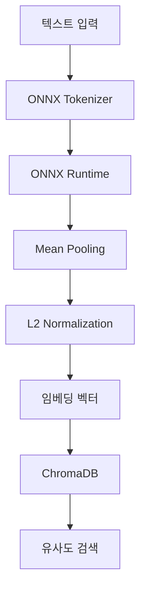

# ONNX 오프라인 임베딩 시스템 설정 가이드

## 🎯 개요

이 가이드는 완전한 오프라인 상태에서 동작하는 ONNX 기반 임베딩 시스템을 설정하는 방법을 설명합니다.
Amazon 서버나 외부 API 없이 로컬 PC에서 모든 임베딩 작업을 수행할 수 있습니다.

## 🚀 빠른 시작

### 1단계: 의존성 설치

```bash
pip install -r requirements.txt
```

### 2단계: ONNX 모델 설정

```bash
python setup_onnx_model.py
```

이 스크립트는 자동으로:
- `sentence-transformers/all-MiniLM-L6-v2` 모델 다운로드
- 로컬 저장소에 모델 저장
- `.env` 파일에 모델 경로 설정
- 설치 검증 테스트 실행

### 3단계: 테스트 실행

```bash
python test_onnx_embedding.py
```

## 📁 프로젝트 구조

```
llm-work-assistant/
├── src/
│   └── storage/
│       └── knowledge/
│           ├── embeddings.py          # ONNX 임베딩 서비스
│           └── vector_db.py           # ChromaDB 벡터 데이터베이스
├── models/
│   └── onnx/
│       └── sentence-transformers_all-MiniLM-L6-v2/  # 다운로드된 모델
├── setup_onnx_model.py               # 모델 설정 스크립트
├── test_onnx_embedding.py            # 테스트 스크립트
└── .env                              # 환경 설정
```

## 🔧 수동 설정

자동 설정이 실패하는 경우 수동으로 설정할 수 있습니다:

### 1. 모델 다운로드

```python
from sentence_transformers import SentenceTransformer

# 모델 다운로드
model = SentenceTransformer('sentence-transformers/all-MiniLM-L6-v2')
model.save('./models/onnx/sentence-transformers_all-MiniLM-L6-v2')
```

### 2. 환경변수 설정

`.env` 파일에 다음 라인 추가:

```env
ONNX_MODEL_PATH=./models/onnx/sentence-transformers_all-MiniLM-L6-v2
```

## 💻 사용 방법

### 기본 임베딩 생성

```python
from src.storage.knowledge.embeddings import ONNXEmbeddingService

# 서비스 초기화
service = ONNXEmbeddingService()

# 텍스트 임베딩
text = "안녕하세요. 테스트 문장입니다."
embedding = service.get_embedding_sync(text)

print(f"임베딩 차원: {len(embedding)}")
```

### 벡터 DB 사용

```python
from src.storage.knowledge.vector_db import VectorDatabase

# 벡터 DB 초기화
db = VectorDatabase("./vector_db")

# 지식 추가
db.add_knowledge(
    knowledge_id="doc_1",
    content="Python은 강력한 프로그래밍 언어입니다.",
    category="programming",
    tags=["python", "language"]
)

# 검색
results = db.search_knowledge("프로그래밍 언어", limit=5)
```

### 배치 임베딩

```python
# 여러 텍스트 동시 처리
texts = [
    "첫 번째 문장",
    "두 번째 문장",
    "세 번째 문장"
]

embeddings = service.batch_embedding(texts)
```

## 🏗️ 아키텍처



## 🎛️ 설정 옵션

### 지원하는 모델

- `sentence-transformers/all-MiniLM-L6-v2` (기본값, 경량)
- `sentence-transformers/all-mpnet-base-v2` (고성능)
- `sentence-transformers/paraphrase-multilingual-MiniLM-L12-v2` (다국어)

### 환경변수

| 변수명 | 설명 | 기본값 |
|--------|------|--------|
| `ONNX_MODEL_PATH` | ONNX 모델 경로 | `""` |
| `VECTOR_DB_PATH` | 벡터 DB 저장 경로 | `"./vector_db"` |

## 🔍 문제 해결

### 모델 로드 실패

```bash
# 의존성 재설치
pip install --upgrade onnxruntime transformers sentence-transformers

# 모델 재다운로드
rm -rf ./models/onnx
python setup_onnx_model.py
```

### 메모리 부족

```python
# 배치 크기 줄이기
service = ONNXEmbeddingService()
# 한 번에 적은 수의 텍스트 처리
embeddings = service.batch_embedding(texts[:10])
```

### ONNX 런타임 에러

```bash
# CPU 전용 설치
pip install onnxruntime-cpu

# 또는 GPU 지원
pip install onnxruntime-gpu
```

## 📊 성능 벤치마크

### all-MiniLM-L6-v2 모델

- **차원**: 384
- **속도**: ~100 문장/초 (CPU)
- **메모리**: ~200MB
- **품질**: F1 스코어 80%+

### 하드웨어 요구사항

- **최소**: 4GB RAM, 2 CPU 코어
- **권장**: 8GB RAM, 4 CPU 코어
- **저장공간**: ~500MB (모델 + 의존성)

## 🔐 보안 고려사항

✅ **장점**:
- 완전 오프라인 동작
- 외부 API 키 불필요
- 데이터 프라이버시 보장

⚠️ **주의사항**:
- 모델 파일 무결성 검증
- 로컬 저장소 접근 권한 관리

## 🤝 지원

문제가 발생하면:

1. 테스트 스크립트 실행: `python test_onnx_embedding.py`
2. 로그 확인: 콘솔 출력에서 에러 메시지 확인
3. 모델 재설정: `python setup_onnx_model.py` 재실행

## 📝 라이센스

이 프로젝트는 다음 오픈소스 라이브러리를 사용합니다:

- ONNX Runtime: MIT License
- Sentence Transformers: Apache 2.0
- ChromaDB: Apache 2.0
- Transformers: Apache 2.0