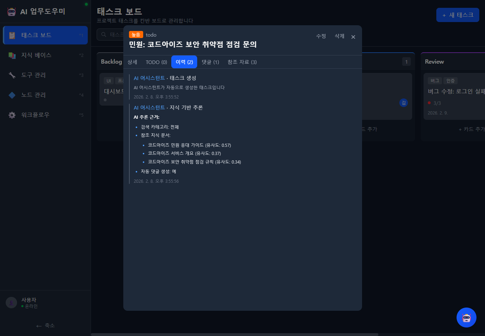
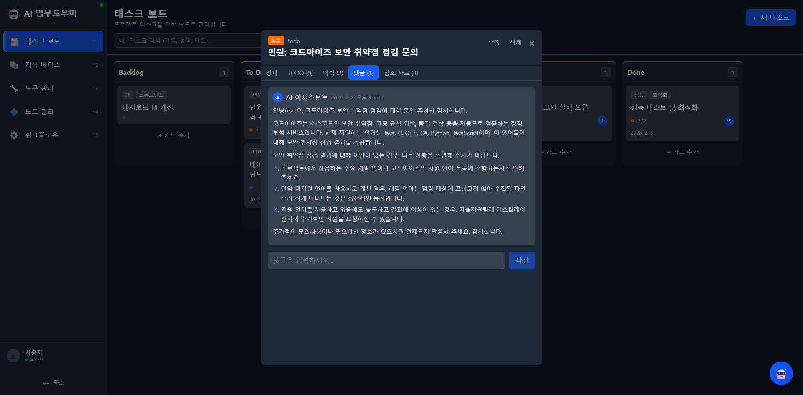
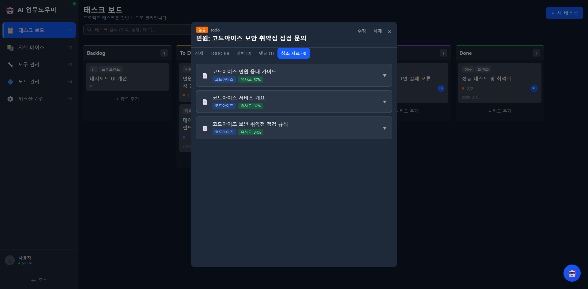

# 태스크 AI 기능

AI 어시스턴트가 지식 베이스를 기반으로 태스크를 자동 생성하고, 추론 과정을 투명하게 기록하며, 관련 참조 자료를 연결합니다.

---

## AI 태스크 자동 생성

AI 어시스턴트와 대화하면서 태스크를 자동으로 생성할 수 있습니다. AI가 대화 내용을 분석하여 적절한 제목, 설명, 우선순위, 태그를 자동 설정합니다.

### 동작 방식

1. 사용자가 AI 채팅에서 업무 관련 요청을 합니다.
2. AI가 지식 베이스에서 관련 문서를 벡터 유사도 검색으로 탐색합니다.
3. 검색된 지식을 기반으로 태스크를 생성합니다.
4. 생성된 태스크에 참조한 지식 문서를 자동 연결합니다.
5. 지식 기반 답변을 댓글로 자동 작성합니다.

---

## 활동 이력 (추론 근거 투명성)

태스크의 **이력** 탭에서 AI의 모든 활동과 추론 과정을 확인할 수 있습니다.

*이력 탭 - AI 어시스턴트의 태스크 생성 기록과 지식 기반 추론 과정이 표시됩니다.*

### 이력에 기록되는 정보

| 항목 | 설명 |
|------|------|
| **AI 어시스턴트 - 태스크 생성** | AI가 자동으로 태스크를 생성한 시점과 내용 |
| **AI 어시스턴트 - 지식 기반 추론** | AI가 어떤 추론 과정을 거쳤는지 상세 기록 |
| **AI 추론 근거** | 검색 카테고리, 참조 지식 문서 목록, 유사도 점수 |
| **자동 댓글 생성** | 지식 기반 답변 댓글 자동 작성 여부 |

### 추론 근거 상세

이력에는 AI가 참조한 지식 문서와 유사도 점수가 명시됩니다:

- **검색 카테고리**: 전체 또는 특정 카테고리
- **참조 지식 문서**: 문서명 + 유사도 점수 (0~1 사이, 높을수록 관련성 높음)
  - 예: "코드아이즈 민원 응대 가이드 (유사도: 0.57)"
  - 예: "코드아이즈 서비스 개요 (유사도: 0.37)"
- **자동 댓글 생성 여부**: 예/아니오

---

## 자동 댓글 생성

AI가 태스크를 생성할 때, 지식 베이스를 기반으로 답변 댓글을 자동으로 작성합니다. 민원이나 문의 태스크에 특히 유용합니다.

*댓글 탭 - AI 어시스턴트가 지식 베이스를 참조하여 작성한 자동 답변 댓글입니다.*

### 자동 댓글 특징

- AI 어시스턴트 아이콘과 작성 시간이 표시됩니다.
- 지식 문서를 기반으로 정확하고 상세한 답변을 제공합니다.
- 번호 매긴 목록, 단계별 안내 등 구조화된 형식으로 작성됩니다.
- 수동 댓글도 입력 필드를 통해 추가할 수 있습니다.

---

## 참조 자료 탭

태스크에 연결된 지식 문서를 **참조 자료** 탭에서 확인할 수 있습니다.

*참조 자료 탭 - AI가 추론에 사용한 지식 문서 목록과 유사도 점수가 표시됩니다.*

### 참조 자료 정보

각 참조 문서에는 다음 정보가 표시됩니다:

| 항목 | 설명 |
|------|------|
| **문서 제목** | 참조된 지식 베이스 문서의 제목 |
| **카테고리 태그** | 문서의 카테고리 (예: 코드아이즈) |
| **유사도 점수** | 질문과의 벡터 유사도 (퍼센트 표시, 예: 57%) |
| **문서 원문** | 펼치기 버튼으로 마크다운 원문 열람 가능 |

### 유사도 점수 해석

| 점수 범위 | 의미 |
|-----------|------|
| 50% 이상 | 높은 관련성 - 핵심 참조 문서 |
| 30~50% | 보통 관련성 - 보조 참고 자료 |
| 30% 미만 | 낮은 관련성 - 간접적 참고 |

---

## 사용 방법

### AI로 태스크 자동 생성하기

1. 우측 하단 AI 어시스턴트 아이콘을 클릭합니다.
2. 업무 관련 요청을 자연어로 입력합니다.
   - 예: "코드아이즈 보안 취약점 점검에 대한 민원이 왔어. 태스크로 만들어줘."
3. AI가 지식 베이스를 검색하고 태스크를 자동 생성합니다.
4. 생성된 태스크의 이력 탭에서 추론 근거를 확인합니다.
5. 참조 자료 탭에서 AI가 참조한 원본 문서를 열람합니다.
6. 댓글 탭에서 AI가 작성한 자동 답변을 확인합니다.

### 참조 자료 확인하기

1. 태스크 카드를 클릭하여 상세 모달을 엽니다.
2. **참조 자료** 탭을 선택합니다.
3. 문서 제목과 유사도 점수를 확인합니다.
4. 펼치기 버튼을 클릭하면 지식 문서 원문을 마크다운 렌더링으로 열람할 수 있습니다.

---

## 관련 문서

- [태스크 보드](02-태스크-보드.md) - 태스크 보드 기본 기능
- [지식 베이스](03-지식-베이스.md) - AI가 참조하는 지식 문서 관리
- [AI 어시스턴트](07-AI-어시스턴트.md) - AI 채팅 어시스턴트 사용법
