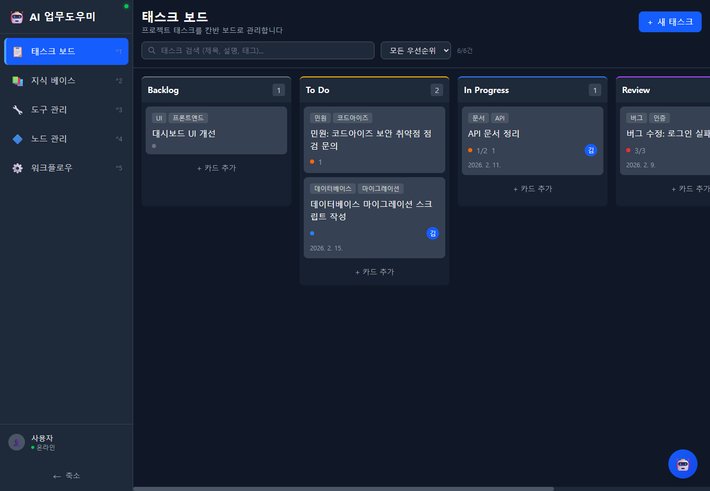
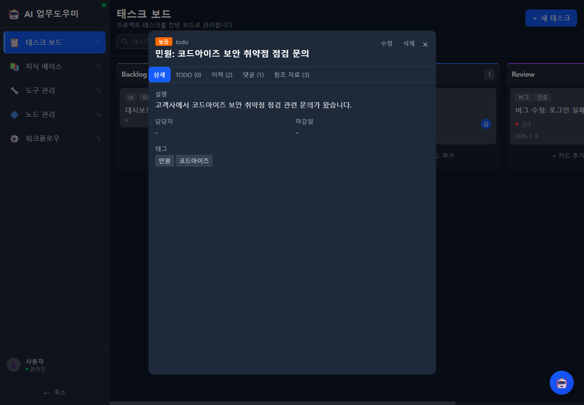

# 태스크 보드

프로젝트 태스크를 Trello 스타일 칸반 보드로 시각적으로 관리합니다.

---

## 화면 구성

*태스크 보드 메인 화면 - 5단계 칸반 보드에 태스크 카드가 배치되어 있습니다.*

---

## 주요 기능

### 칸반 보드 (5단계 상태)

태스크를 진행 상태에 따라 5개 컬럼으로 분류합니다.

| 상태 | 설명 |
|------|------|
| **Backlog** | 아직 시작 전인 대기 태스크 |
| **To Do** | 착수 예정인 태스크 |
| **In Progress** | 현재 진행 중인 태스크 |
| **Review** | 검토/리뷰 단계의 태스크 |
| **Done** | 완료된 태스크 |

### 태스크 카드 정보

각 카드에는 다음 정보가 표시됩니다:

- **태그**: 카드 상단에 컬러 태그 (예: UI, 프론트엔드, 민원, 코드아이즈)
- **제목**: 태스크 제목
- **우선순위 표시**: 색상 원으로 긴급(빨강)/높음(주황)/보통(파랑)/낮음(회색) 구분
- **TODO 진행률**: 체크리스트 완료 현황 (예: 1/2)
- **담당자 아바타**: 배정된 담당자 표시
- **마감일**: 마감 기한 표시

### 검색 및 필터

- **검색**: 제목, 설명, 태그로 태스크 검색
- **우선순위 필터**: "모든 우선순위" 드롭다운으로 필터링
- **건수 표시**: 필터 결과 건수 (예: 6/6건)

### 드래그앤드롭

태스크 카드를 드래그하여 다른 상태 컬럼으로 이동할 수 있습니다. HTML5 드래그앤드롭으로 구현되어 별도 플러그인 없이 동작합니다.

---

## 태스크 상세 보기

태스크 카드를 클릭하면 상세 모달이 표시됩니다.

*태스크 상세 모달 - 상세 탭에서 설명, 담당자, 마감일, 태그 정보를 확인합니다.*

### 상세 모달 탭 구성

| 탭 | 설명 |
|------|------|
| **상세** | 설명, 담당자, 마감일, 태그 정보 |
| **TODO** | 체크리스트 (완료/미완료 토글) |
| **이력** | 활동 이력 (생성, 상태 변경, AI 추론 기록) |
| **댓글** | 수동/자동 생성 댓글 |
| **참조 자료** | AI가 참조한 지식 문서 목록 |

### 태스크 속성

| 속성 | 설명 |
|------|------|
| **상태** | 현재 진행 상태 (Backlog ~ Done) |
| **우선순위** | 긴급 / 높음 / 보통 / 낮음 |
| **설명** | 태스크 상세 설명 |
| **담당자** | 배정된 담당자 |
| **마감일** | 마감 기한 |
| **태그** | 분류 태그 (복수 지정 가능) |

---

## 사용 방법

### 새 태스크 만들기

1. 우측 상단 **+ 새 태스크** 버튼을 클릭합니다.
2. 제목, 설명, 우선순위, 태그, 담당자, 마감일을 입력합니다.
3. **저장** 버튼을 클릭하면 Backlog 컬럼에 추가됩니다.

> 단축키: `Ctrl+N`으로 빠르게 새 태스크 생성 모달을 열 수 있습니다.

### 컬럼 내에서 카드 추가

각 컬럼 하단의 **+ 카드 추가** 버튼을 클릭하면 해당 상태로 직접 태스크를 추가할 수 있습니다.

### 태스크 상태 변경

태스크 카드를 드래그하여 원하는 상태 컬럼으로 이동합니다.

### 태스크 수정/삭제

1. 태스크 카드를 클릭하여 상세 모달을 엽니다.
2. 모달 우측 상단의 **수정** 버튼으로 편집 모드로 전환합니다.
3. 내용을 수정한 후 저장합니다.
4. **삭제** 버튼으로 태스크를 삭제할 수 있습니다.

### TODO 체크리스트 사용

1. 태스크 상세에서 **TODO** 탭을 선택합니다.
2. 체크박스를 클릭하여 항목을 완료/미완료로 토글합니다.
3. 카드에 TODO 진행률(예: 1/2)이 표시됩니다.

### 태스크 검색

1. 상단 검색창에 키워드를 입력합니다.
2. 제목, 설명, 태그에서 일치하는 태스크만 필터링됩니다.
3. 우선순위 드롭다운으로 추가 필터링할 수 있습니다.

---

## 관련 문서

- [태스크 AI 기능](02-1-태스크-AI기능.md) - AI 자동 태스크 생성, 활동 이력, 참조 자료
- [AI 어시스턴트](07-AI-어시스턴트.md) - AI 채팅으로 태스크 생성하기
