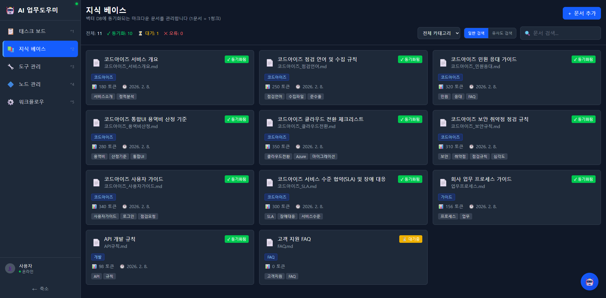

# 지식 베이스

마크다운 문서를 벡터 DB에 동기화하여 AI가 검색하고 활용할 수 있는 지식 저장소를 관리합니다.

---

## 화면 구성

*지식 베이스 메인 화면 - 카드 형태로 문서 목록이 표시되며, 동기화 상태와 토큰 수를 확인할 수 있습니다.*

---

## 핵심 개념: 1문서 = 1청크

지식 베이스는 **1문서 = 1청크** 방식으로 동작합니다. 문서 전체가 하나의 벡터로 변환되어 ChromaDB에 저장됩니다. 이 방식으로 문서 단위의 유사도 검색이 가능합니다.

---

## 주요 기능

### 문서 카드 정보

각 문서 카드에는 다음 정보가 표시됩니다:

| 항목 | 설명 |
|------|------|
| **제목** | 문서 제목 |
| **파일명** | 저장된 마크다운 파일명 (예: 코드아이즈_서비스개요.md) |
| **카테고리** | 문서 분류 카테고리 (예: 코드아이즈, 가이드, 개발, FAQ) |
| **동기화 상태** | 동기화됨(녹색) / 대기중(주황) / 오류(빨강) |
| **토큰 수** | 문서의 토큰 수 (예: 180 토큰) |
| **수정일** | 마지막 수정 날짜 |
| **태그** | 분류용 태그 (예: 서비스소개, 정직분석, API, 규칙 등) |

### 동기화 상태

| 상태 | 표시 | 설명 |
|------|------|------|
| **동기화됨** | 녹색 배지 | 벡터 DB에 최신 상태로 동기화됨 |
| **대기중** | 주황 배지 | 문서가 수정되어 재동기화 대기 중 |
| **오류** | 빨강 배지 | 동기화 중 오류 발생 |

### 통계 요약

화면 상단에 문서 현황이 요약됩니다:

- 전체 문서 수
- 동기화 완료 수
- 대기 중 수
- 오류 수

### 검색 기능

두 가지 검색 모드를 지원합니다:

| 모드 | 설명 |
|------|------|
| **일반 검색** | 제목, 내용, 태그에서 키워드 매칭 검색 |
| **유사도 검색** | 벡터 유사도 기반 의미적 검색 (AI 활용 시 동일 방식) |

### 카테고리 필터

"전체 카테고리" 드롭다운에서 특정 카테고리만 필터링하여 볼 수 있습니다.

---

## 사용 방법

### 새 문서 추가하기

1. 우측 상단 **+ 문서 추가** 버튼을 클릭합니다.
2. 문서 제목을 입력합니다.
3. 카테고리를 선택합니다.
4. 마크다운 형식으로 문서 본문을 작성합니다.
5. 태그를 추가합니다 (선택사항).
6. **저장** 버튼을 클릭합니다.
7. 저장 후 자동으로 벡터 DB에 동기화가 시작됩니다.

### 문서 수정하기

1. 문서 카드를 클릭하여 상세 화면을 엽니다.
2. 내용을 수정합니다.
3. **저장** 버튼을 클릭합니다.
4. 동기화 상태가 "대기중"으로 변경된 후, 자동으로 재동기화됩니다.

### 유사도 검색 사용하기

1. 검색 모드를 **유사도 검색**으로 전환합니다.
2. 자연어로 질문이나 키워드를 입력합니다.
   - 예: "보안 취약점 점검 절차"
3. 의미적으로 관련된 문서가 유사도 순으로 정렬됩니다.

### 문서 삭제하기

1. 문서 카드를 클릭하여 상세 화면을 엽니다.
2. **삭제** 버튼을 클릭합니다.
3. 확인 다이얼로그에서 삭제를 확정합니다.
4. 벡터 DB에서도 해당 문서 벡터가 제거됩니다.

---

## AI 연동

지식 베이스에 등록된 문서는 다음과 같이 AI에 활용됩니다:

1. **AI 어시스턴트 질의 응답**: 사용자 질문과 유사한 문서를 자동 검색하여 답변에 활용
2. **태스크 자동 생성**: 태스크 생성 시 관련 지식 문서를 참조 자료로 연결
3. **자동 댓글 작성**: 민원/문의 태스크에 지식 기반 답변 댓글 생성

> 문서의 동기화 상태가 "동기화됨"이어야 AI 검색에 활용됩니다. "대기중" 또는 "오류" 상태의 문서는 검색 대상에서 제외될 수 있습니다.

---

## 관련 문서

- [태스크 AI 기능](02-1-태스크-AI기능.md) - 지식 기반 태스크 자동 생성
- [AI 어시스턴트](07-AI-어시스턴트.md) - AI 채팅에서 지식 활용
