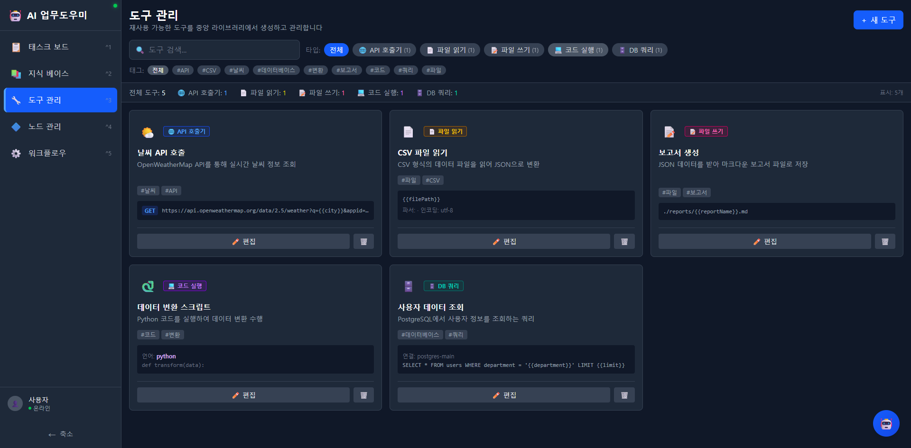

# 도구 관리

재사용 가능한 도구를 중앙 라이브러리에서 생성하고 관리합니다. 등록된 도구는 AI 노드에 바인딩하여 워크플로우에서 활용할 수 있습니다.

---

## 화면 구성

*도구 관리 메인 화면 - 5가지 타입의 도구가 카드 형태로 표시되며, 타입/태그 필터로 원하는 도구를 찾을 수 있습니다.*

---

## 도구 타입 (5가지)

| 타입 | 아이콘 | 설명 | 예시 |
|------|--------|------|------|
| **API 호출기** | 녹색 | 외부 REST API를 호출하여 데이터를 가져옴 | 날씨 API 호출, OpenWeatherMap |
| **파일 읽기** | 보라색 | 파일 시스템에서 파일을 읽어 데이터 추출 | CSV 파일 읽기, 로그 파일 파싱 |
| **파일 쓰기** | 보라색 | 데이터를 파일로 출력하여 저장 | 보고서 생성, 마크다운 파일 저장 |
| **코드 실행** | 청색 | Python 코드를 실행하여 데이터 변환/처리 | 데이터 변환 스크립트 |
| **DB 쿼리** | 분홍색 | 데이터베이스에 SQL 쿼리를 실행 | 사용자 데이터 조회 |

---

## 도구 카드 정보

각 도구 카드에는 다음 정보가 표시됩니다:

| 항목 | 설명 |
|------|------|
| **타입 배지** | 도구 타입을 나타내는 컬러 배지 |
| **도구명** | 도구의 이름 |
| **설명** | 도구의 기능 설명 |
| **태그** | 분류 태그 (예: #날씨, #API, #CSV, #파일) |
| **설정 미리보기** | 타입별 주요 설정 미리보기 (URL, 파일 경로, 코드 등) |
| **편집/삭제 버튼** | 카드 하단에서 바로 편집 또는 삭제 |

### 타입별 미리보기

- **API 호출기**: HTTP 메서드 + URL (예: `GET https://api.openweathermap.org/...`)
- **파일 읽기**: 파일 경로 + 파서/인코딩 (예: `{{filePath}}`, 파서: 인코딩: utf-8)
- **파일 쓰기**: 출력 경로 (예: `./reports/{{reportName}}.md`)
- **코드 실행**: 언어 + 코드 시작 부분 (예: `python`, `def transform(data):`)
- **DB 쿼리**: 연결 문자열 + SQL 시작 부분 (예: `postgres-main`, `SELECT * FROM...`)

---

## 필터링 기능

### 타입 필터

화면 상단에서 도구 타입별로 필터링할 수 있습니다:
- 전체 / API 호출기 / 파일 읽기 / 파일 쓰기 / 코드 실행 / DB 쿼리
- 각 타입 옆에 해당 도구 수가 표시됩니다 (예: API 호출기 (1))

### 태그 필터

등록된 모든 태그가 버튼으로 표시되며, 클릭하여 해당 태그의 도구만 필터링할 수 있습니다.

### 검색

검색창에 도구명이나 설명 키워드를 입력하여 검색할 수 있습니다.

### 통계 요약

- 전체 도구 수
- 타입별 도구 수
- 현재 표시 건수

---

## 사용 방법

### 새 도구 만들기

1. 우측 상단 **+ 새 도구** 버튼을 클릭합니다.
2. 도구 타입을 선택합니다 (API 호출기 / 파일 읽기 / 파일 쓰기 / 코드 실행 / DB 쿼리).
3. 도구 이름과 설명을 입력합니다.
4. 타입별 설정을 입력합니다:
   - **API 호출기**: HTTP 메서드, URL, 헤더, 요청 본문
   - **파일 읽기**: 파일 경로, 파서, 인코딩
   - **파일 쓰기**: 출력 경로, 포맷
   - **코드 실행**: 프로그래밍 언어, 코드
   - **DB 쿼리**: 연결 문자열, SQL 쿼리
5. 태그를 추가합니다 (선택사항).
6. **저장** 버튼을 클릭합니다.

### 도구 편집하기

1. 도구 카드 하단의 **편집** 버튼을 클릭합니다.
2. 설정을 수정합니다.
3. **저장** 버튼을 클릭합니다.

### 도구 삭제하기

1. 도구 카드 하단의 **삭제(휴지통)** 아이콘을 클릭합니다.
2. 확인 다이얼로그에서 삭제를 확정합니다.

> 주의: 삭제된 도구가 AI 노드에 바인딩되어 있는 경우, 해당 노드의 기능에 영향을 줄 수 있습니다.

### 도구 설정 시 변수 사용

도구 설정에서 `{{변수명}}` 형태의 템플릿 변수를 사용할 수 있습니다. 이 변수는 워크플로우 실행 시 실제 값으로 치환됩니다.

예시:
- `https://api.openweathermap.org/data/2.5/weather?q={{city}}&appid=...`
- `{{filePath}}`
- `./reports/{{reportName}}.md`
- `SELECT * FROM users WHERE department = '{{department}}' LIMIT {{limit}}`

---

## 관련 문서

- [노드 관리](05-노드-관리.md) - 도구를 AI 노드에 바인딩하기
- [워크플로우](06-워크플로우.md) - 도구가 포함된 노드로 워크플로우 구성
