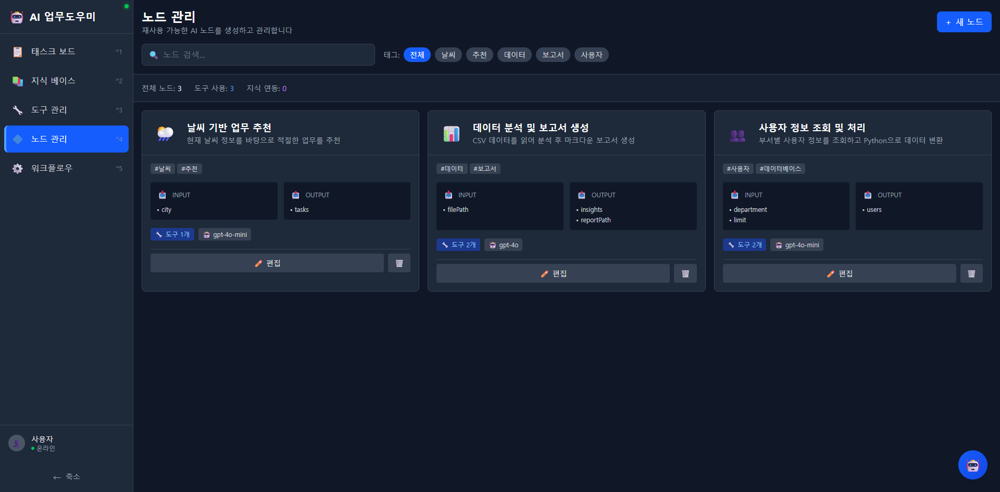

# 노드 관리

재사용 가능한 AI 노드를 생성하고 관리합니다. AI 노드는 도구를 바인딩하고, LLM 모델을 설정하며, 입출력 스키마를 정의하는 자동화의 기본 단위입니다.

---

## 화면 구성


*노드 관리 메인 화면 - 각 AI 노드의 설명, 입출력 스키마, 바인딩된 도구 수, LLM 모델이 카드에 표시됩니다.*

---

## 핵심 개념

AI 노드는 워크플로우의 구성 단위입니다. 하나의 노드는 다음 요소로 구성됩니다:

```
AI 노드 = 도구(Tool) + LLM 모델 + 입출력 스키마 + 프롬프트
```

| 구성 요소 | 설명 |
|-----------|------|
| **도구 바인딩** | 노드가 사용할 도구 목록 (도구 관리에서 등록한 도구) |
| **LLM 모델** | 사용할 AI 모델 (예: gpt-4o, gpt-4o-mini) |
| **입력 스키마** | 노드가 받는 입력 변수 정의 |
| **출력 스키마** | 노드가 생성하는 출력 변수 정의 |
| **프롬프트** | LLM에게 전달할 시스템 프롬프트 |

---

## 노드 카드 정보

각 노드 카드에는 다음 정보가 표시됩니다:

| 항목 | 설명 |
|------|------|
| **노드명** | 노드의 이름 (예: 날씨 기반 업무 추천) |
| **설명** | 노드의 기능 설명 |
| **태그** | 분류 태그 (예: #날씨, #추천, #데이터, #보고서) |
| **INPUT** | 입력 변수 목록 (예: city, filePath) |
| **OUTPUT** | 출력 변수 목록 (예: tasks, insights, reportPath) |
| **도구 수** | 바인딩된 도구 개수 (예: 도구 1개, 도구 2개) |
| **LLM 모델** | 사용 중인 AI 모델 (예: gpt-4o, gpt-4o-mini) |

---

## 노드 예시

화면에서 확인할 수 있는 노드 예시:

### 날씨 기반 업무 추천
- **설명**: 현재 날씨 정보를 바탕으로 적절한 업무를 추천
- **입력**: city
- **출력**: tasks
- **도구**: 1개 (날씨 API 호출기)
- **모델**: gpt-4o-mini

### 데이터 분석 및 보고서 생성
- **설명**: CSV 데이터를 읽어 분석 후 마크다운 보고서 파일로 저장
- **입력**: filePath
- **출력**: insights, reportPath
- **도구**: 2개 (CSV 파일 읽기, 보고서 생성)
- **모델**: gpt-4o

### 사용자 정보 조회 및 처리
- **설명**: 부서별 사용자 정보를 조회하고 Python으로 데이터 변환
- **입력**: department, limit
- **출력**: users
- **도구**: 2개 (사용자 데이터 조회, 데이터 변환 스크립트)
- **모델**: gpt-4o-mini

---

## 필터링 기능

### 태그 필터

화면 상단에서 태그별로 노드를 필터링할 수 있습니다:
- 전체 / 날씨 / 추천 / 데이터 / 보고서 / 사용자

### 검색

검색창에 노드명이나 설명 키워드를 입력하여 검색할 수 있습니다.

### 통계 요약

- 전체 노드 수
- 도구 사용 수
- 지식 연동 수

---

## 사용 방법

### 새 노드 만들기

1. 우측 상단 **+ 새 노드** 버튼을 클릭합니다.
2. 노드 이름과 설명을 입력합니다.
3. **도구 바인딩**: 도구 관리에서 등록한 도구 중 사용할 도구를 선택합니다.
4. **LLM 모델**: 사용할 AI 모델을 선택합니다.
   - `gpt-4o`: 높은 정확도가 필요한 복잡한 작업
   - `gpt-4o-mini`: 빠른 응답이 필요한 단순 작업
5. **입력 스키마**: 노드가 받을 입력 변수를 정의합니다.
6. **출력 스키마**: 노드가 생성할 출력 변수를 정의합니다.
7. **프롬프트**: LLM에게 전달할 시스템 프롬프트를 작성합니다.
8. 태그를 추가합니다 (선택사항).
9. **저장** 버튼을 클릭합니다.

### 노드 편집하기

1. 노드 카드 하단의 **편집** 버튼을 클릭합니다.
2. 설정을 수정합니다.
3. **저장** 버튼을 클릭합니다.

### 노드 삭제하기

1. 노드 카드 하단의 **삭제(휴지통)** 아이콘을 클릭합니다.
2. 확인 다이얼로그에서 삭제를 확정합니다.

> 주의: 삭제된 노드가 워크플로우에서 사용 중인 경우, 해당 워크플로우의 기능에 영향을 줄 수 있습니다.

---

## 도구 - 노드 - 워크플로우 관계

```
도구 (Tool)          →   노드 (Node)        →   워크플로우 (Workflow)
━━━━━━━━━━━━━         ━━━━━━━━━━━━━━         ━━━━━━━━━━━━━━━━━━
API 호출기     ──┐     날씨 기반 업무 추천 ──┐
                 ├──►                        ├──► 일일 업무 추천 자동화
파일 읽기      ──┤     데이터 분석 및      ──┤
파일 쓰기      ──┤     보고서 생성         ──┤
                 │                           │
코드 실행      ──┤     사용자 정보 조회    ──┘
DB 쿼리        ──┘     및 처리
```

---

## 관련 문서

- [도구 관리](04-도구-관리.md) - 노드에 바인딩할 도구 등록
- [워크플로우](06-워크플로우.md) - 노드를 연결하여 워크플로우 구성
