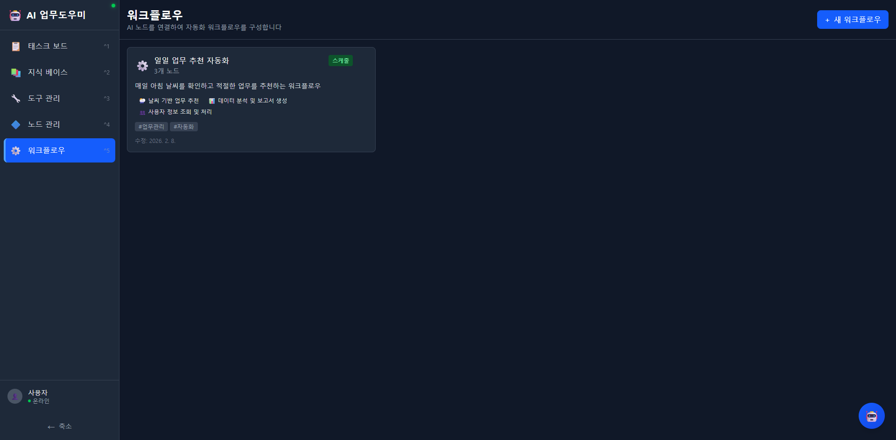
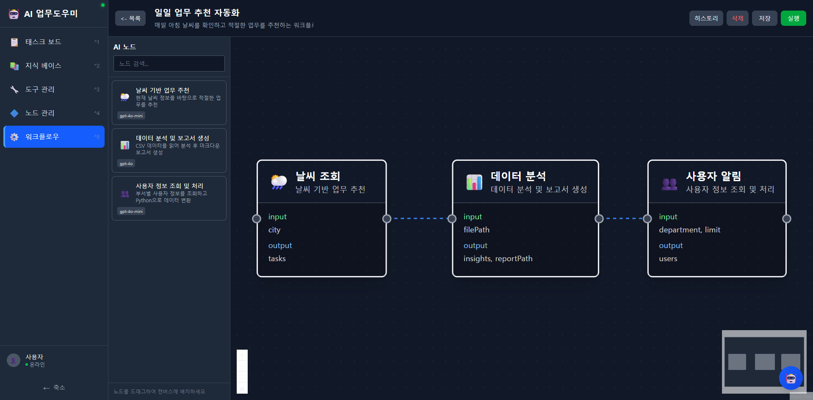

# 워크플로우

AI 노드를 시각적 캔버스에서 연결하여 자동화 워크플로우를 구성하고 실행합니다. n8n 스타일의 비주얼 워크플로우 빌더를 제공합니다.

---

## 워크플로우 목록


*워크플로우 목록 화면 - 등록된 워크플로우의 이름, 설명, 포함된 노드, 태그가 표시됩니다.*

### 목록 카드 정보

| 항목 | 설명 |
|------|------|
| **워크플로우명** | 워크플로우의 이름 |
| **트리거 배지** | 트리거 유형 (예: 스케줄) |
| **노드 수** | 포함된 AI 노드 수 |
| **설명** | 워크플로우의 기능 설명 |
| **포함 노드 목록** | 사용된 AI 노드 이름 나열 |
| **태그** | 분류 태그 |
| **수정일** | 마지막 수정 날짜 |

---

## 워크플로우 캔버스


*워크플로우 캔버스 화면 - AI 노드를 드래그앤드롭으로 배치하고, 점선으로 연결하여 데이터 흐름을 구성합니다.*

### 캔버스 구성

| 영역 | 설명 |
|------|------|
| **왼쪽 패널 (AI 노드)** | 사용 가능한 AI 노드 목록, 검색 가능, 드래그하여 캔버스에 배치 |
| **중앙 캔버스** | 노드 배치 및 연결 영역, 줌/팬 지원 |
| **상단 버튼** | 목록으로 돌아가기, 히스토리, 삭제, 저장, 실행 버튼 |

### 캔버스 노드 카드

캔버스에 배치된 각 노드에는 다음 정보가 표시됩니다:

- **노드 아이콘 + 이름**: 큰 글씨로 노드명 표시
- **설명**: 노드의 간략한 설명
- **input**: 입력 변수 목록 (녹색 텍스트)
- **output**: 출력 변수 목록 (녹색 텍스트)
- **연결 포트**: 좌측(입력)과 우측(출력)에 연결 포트

### 노드 연결

- 노드 간 **점선 화살표**로 데이터 흐름을 표시합니다.
- 앞 노드의 output이 뒤 노드의 input으로 전달됩니다.
- 연결선을 드래그하여 새 연결을 만들 수 있습니다.

---

## 주요 기능

### 워크플로우 실행

**실행** 버튼을 클릭하면 워크플로우가 순서대로 실행됩니다:

1. 첫 번째 노드부터 순차 실행
2. 각 노드가 바인딩된 도구를 호출
3. LLM API로 AI 추론 수행
4. 결과를 다음 노드에 전달
5. SSE(Server-Sent Events)로 실행 진행 상황을 실시간 스트리밍

### 실행 이력

**히스토리** 버튼으로 이전 실행 기록을 확인할 수 있습니다:

- 실행 일시
- 실행 상태 (성공/실패)
- 각 노드별 실행 결과
- 실행 소요 시간

### 캔버스 조작

| 조작 | 방법 |
|------|------|
| **노드 배치** | 왼쪽 패널에서 노드를 드래그하여 캔버스에 놓기 |
| **노드 이동** | 캔버스의 노드를 드래그하여 위치 이동 |
| **노드 연결** | 노드의 출력 포트에서 드래그하여 다른 노드의 입력 포트에 연결 |
| **노드 삭제** | 노드 선택 후 Delete 또는 Backspace 키 |
| **줌** | 마우스 휠로 확대/축소 |
| **팬** | 빈 공간을 드래그하여 캔버스 이동 |
| **미니맵** | 우측 하단 미니맵으로 전체 뷰 확인 |

---

## 사용 방법

### 새 워크플로우 만들기

1. 워크플로우 목록 화면에서 우측 상단 **+ 새 워크플로우** 버튼을 클릭합니다.
2. 워크플로우 이름과 설명을 입력합니다.
3. 캔버스 화면으로 이동합니다.

### 노드 배치하기

1. 왼쪽 **AI 노드** 패널에서 사용할 노드를 찾습니다.
   - 검색창에 키워드를 입력하여 필터링할 수 있습니다.
2. 노드를 드래그하여 캔버스에 놓습니다.
3. 필요한 노드를 모두 배치합니다.

### 노드 연결하기

1. 앞 노드의 우측 출력 포트를 클릭합니다.
2. 드래그하여 뒤 노드의 좌측 입력 포트에 놓습니다.
3. 점선 화살표가 생성되어 데이터 흐름이 연결됩니다.

### 워크플로우 저장하기

1. 상단의 **저장** 버튼을 클릭합니다.
2. 노드 배치와 연결 정보가 저장됩니다.

### 워크플로우 실행하기

1. 상단의 **실행** 버튼을 클릭합니다.
2. 실행 진행 상황이 실시간으로 표시됩니다.
3. 각 노드의 실행 결과를 확인합니다.
4. 실행 완료 후 히스토리에 기록됩니다.

### 실행 이력 확인하기

1. 상단의 **히스토리** 버튼을 클릭합니다.
2. 이전 실행 기록 목록을 확인합니다.
3. 특정 실행을 선택하여 상세 결과를 확인합니다.

---

## 워크플로우 예시: 일일 업무 추천 자동화

화면에서 확인할 수 있는 워크플로우 예시:

**이름**: 일일 업무 추천 자동화

**설명**: 매일 아침 날씨를 확인하고 적절한 업무를 추천하는 워크플로우

**노드 구성** (3개 노드, 순차 실행):

```
날씨 조회 → 데이터 분석 → 사용자 알림
```

1. **날씨 조회** (날씨 기반 업무 추천)
   - 입력: city
   - 출력: tasks
   - 모델: gpt-4o-mini

2. **데이터 분석** (데이터 분석 및 보고서 생성)
   - 입력: filePath
   - 출력: insights, reportPath
   - 모델: gpt-4o

3. **사용자 알림** (사용자 정보 조회 및 처리)
   - 입력: department, limit
   - 출력: users
   - 모델: gpt-4o-mini

---

## 관련 문서

- [노드 관리](05-노드-관리.md) - 워크플로우에서 사용할 AI 노드 정의
- [도구 관리](04-도구-관리.md) - 노드에 바인딩할 도구 등록
