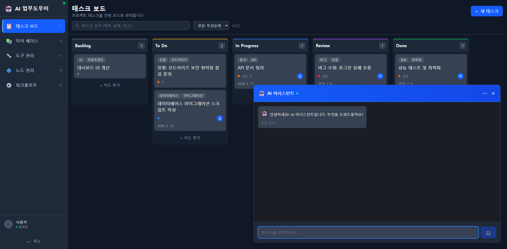

# AI 어시스턴트

모든 페이지에서 사용 가능한 AI 채팅 어시스턴트입니다. 지식 베이스를 기반으로 질문에 답변하고, 태스크를 자동 생성하며, 업무를 지원합니다.

---

## 화면 구성

*AI 어시스턴트 - 우측 하단에 챗봇 위젯이 떠 있으며, 모든 페이지에서 접근할 수 있습니다.*

---

## 주요 기능

### 1. 페이지별 컨텍스트 인식

AI 어시스턴트는 현재 보고 있는 페이지의 컨텍스트를 자동으로 인식합니다:

| 페이지 | AI 컨텍스트 |
|--------|------------|
| **태스크 보드** | 태스크 목록, 상태, 우선순위 인식 |
| **지식 베이스** | 등록된 문서 목록, 카테고리 인식 |
| **도구 관리** | 등록된 도구 목록 인식 |
| **노드 관리** | AI 노드 구성 인식 |
| **워크플로우** | 워크플로우 구성 인식 |

### 2. 지식 기반 추론 (RAG)

사용자의 질문에 지식 베이스에서 관련 문서를 벡터 유사도 검색으로 찾아 답변에 활용합니다.

**동작 과정**:
1. 사용자 질문 수신
2. 질문을 ONNX 임베딩 모델로 벡터화
3. ChromaDB에서 유사 문서 검색
4. 관련 문서를 컨텍스트로 LLM에 전달
5. 지식 기반 답변 생성 및 반환

### 3. 태스크 자동 생성

대화 내용을 바탕으로 태스크를 자동 생성합니다:
- 제목, 설명, 우선순위, 태그 자동 설정
- 관련 지식 문서를 참조 자료로 연결
- 활동 이력에 추론 근거 기록
- 지식 기반 답변 댓글 자동 생성

### 4. 마크다운 렌더링

AI 응답은 마크다운 형식으로 렌더링됩니다:
- **테이블**: 구조화된 데이터 표시
- **번호 목록 / 글머리 기호**: 단계별 안내
- **볼드 / 이탤릭**: 강조 표시
- **코드블록**: 코드 및 명령어 표시
- **링크**: 관련 리소스 연결

### 5. 타임스탬프

각 메시지에 발송 시간이 표시되어 대화 이력을 추적할 수 있습니다.

---

## 채팅 위젯 UI

| 요소 | 설명 |
|------|------|
| **AI 어시스턴트 헤더** | 파란색 헤더에 "AI 어시스턴트" 타이틀 + 온라인 상태 표시 |
| **최소화 버튼** | 헤더의 `-` 아이콘으로 위젯 최소화 |
| **닫기 버튼** | 헤더의 `x` 아이콘으로 위젯 닫기 |
| **메시지 영역** | 대화 내용이 표시되는 스크롤 영역 |
| **입력 필드** | 하단의 "메시지를 입력하세요..." 텍스트 입력창 |
| **전송 버튼** | 입력 필드 우측의 전송 아이콘 |
| **플로팅 버튼** | 우측 하단의 로봇 아이콘 (위젯이 닫혀 있을 때 표시) |

---

## 사용 방법

### AI 어시스턴트 열기

1. 우측 하단의 **로봇 아이콘** 플로팅 버튼을 클릭합니다.
2. AI 어시스턴트 채팅 위젯이 열립니다.
3. "안녕하세요! AI 어시스턴트입니다. 무엇을 도와드릴까요?" 환영 메시지가 표시됩니다.

### 질문하기

1. 하단 입력 필드에 질문을 입력합니다.
2. **전송** 버튼을 클릭하거나 Enter 키를 누릅니다.
3. AI가 지식 베이스를 검색하고 답변을 생성합니다.
4. 마크다운 형식으로 렌더링된 답변이 표시됩니다.

### AI로 태스크 만들기

1. AI 어시스턴트에 태스크 생성을 요청합니다.
   - 예: "코드아이즈 보안 점검 관련 민원이 왔어. 태스크로 만들어줘."
2. AI가 지식 베이스를 검색하여 관련 문서를 찾습니다.
3. 태스크가 자동 생성되고, 태스크 보드에 추가됩니다.
4. 생성된 태스크에 참조 자료와 자동 댓글이 연결됩니다.

### 위젯 관리

- **최소화**: 헤더의 `-` 버튼으로 위젯을 최소화합니다.
- **닫기**: 헤더의 `x` 버튼으로 위젯을 닫습니다.
- **다시 열기**: 플로팅 로봇 아이콘을 클릭합니다.

---

## 활용 예시

### 업무 관련 질문

> **사용자**: "코드아이즈 서비스에서 지원하는 프로그래밍 언어가 뭐야?"
>
> **AI**: 지식 베이스의 "코드아이즈 점검 언어 및 수집 규칙" 문서를 참조하여 Java, C, C++, C#, Python, JavaScript 등 지원 언어 목록을 답변합니다.

### 민원 대응

> **사용자**: "고객사에서 보안 취약점 점검 관련 문의가 왔어. 태스크 만들어줘."
>
> **AI**: 관련 지식 문서 3건(민원 응대 가이드, 서비스 개요, 보안 취약점 점검 규칙)을 참조하여 태스크를 생성하고, 지식 기반 답변 댓글을 자동 작성합니다.

### 업무 프로세스 안내

> **사용자**: "회사 업무 프로세스가 어떻게 되지?"
>
> **AI**: 지식 베이스의 "회사 업무 프로세스 가이드" 문서를 참조하여 절차를 안내합니다.

---

## 자동 데이터 리프레시

AI 어시스턴트가 태스크를 생성하거나 데이터를 변경하면, 현재 페이지의 데이터가 자동으로 리프레시됩니다. 별도로 새로고침할 필요 없이 변경사항이 즉시 반영됩니다.

---

## 관련 문서

- [태스크 AI 기능](02-1-태스크-AI기능.md) - AI가 생성한 태스크의 이력, 댓글, 참조 자료
- [지식 베이스](03-지식-베이스.md) - AI가 참조하는 지식 문서 관리
- [태스크 보드](02-태스크-보드.md) - 태스크 보드 기본 기능
