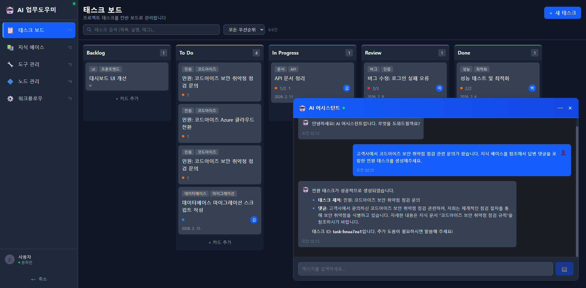
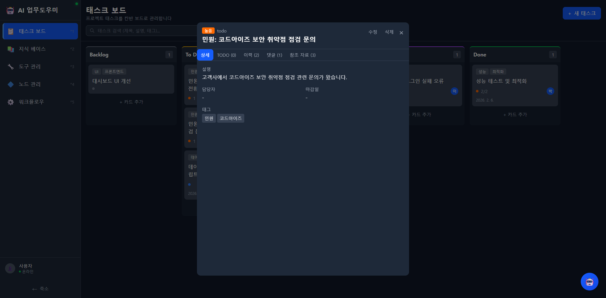
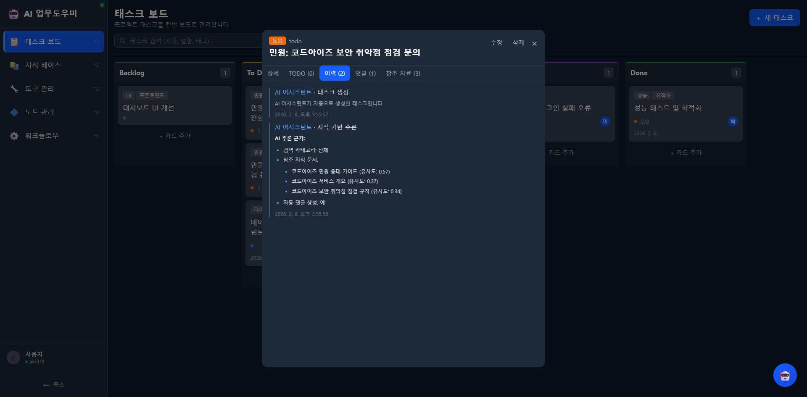
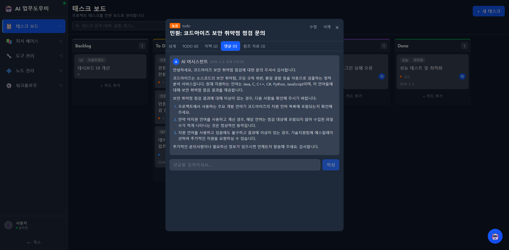
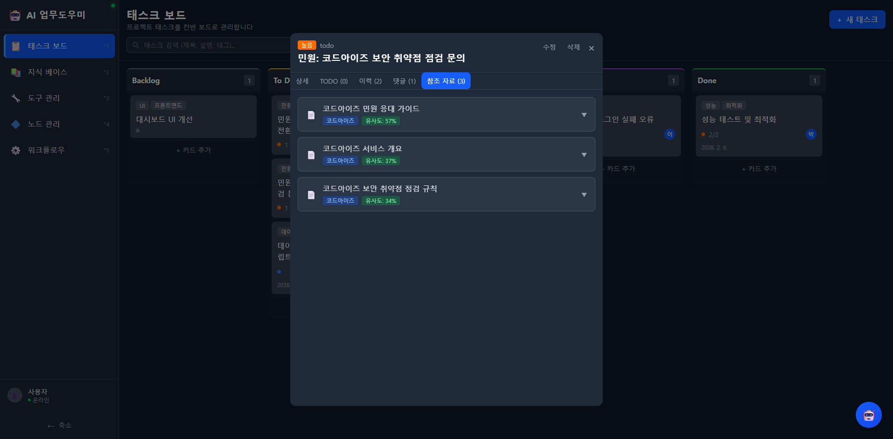
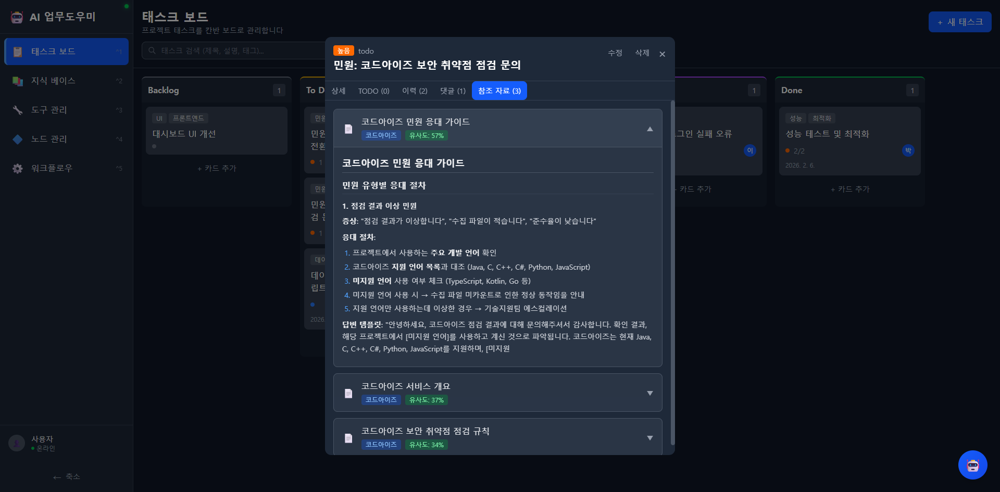
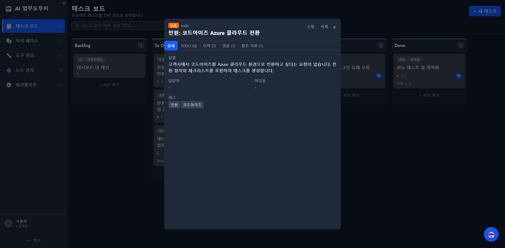
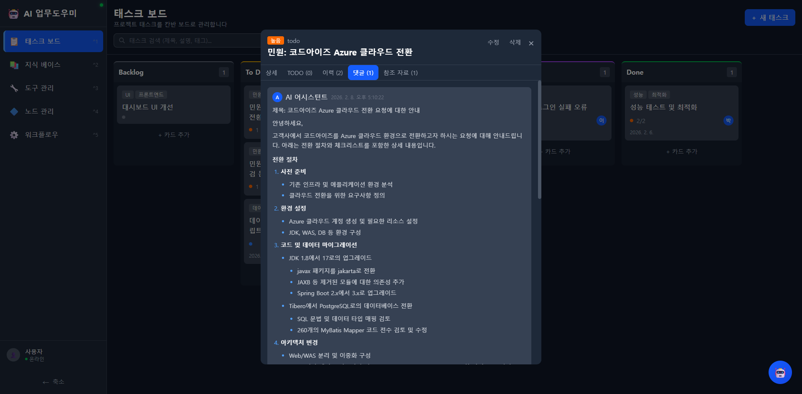
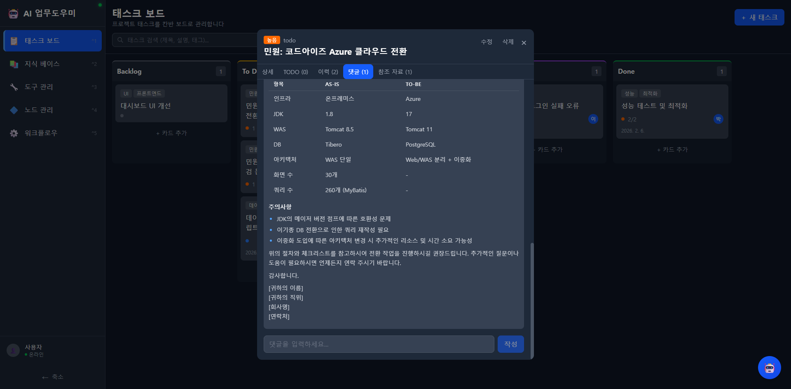
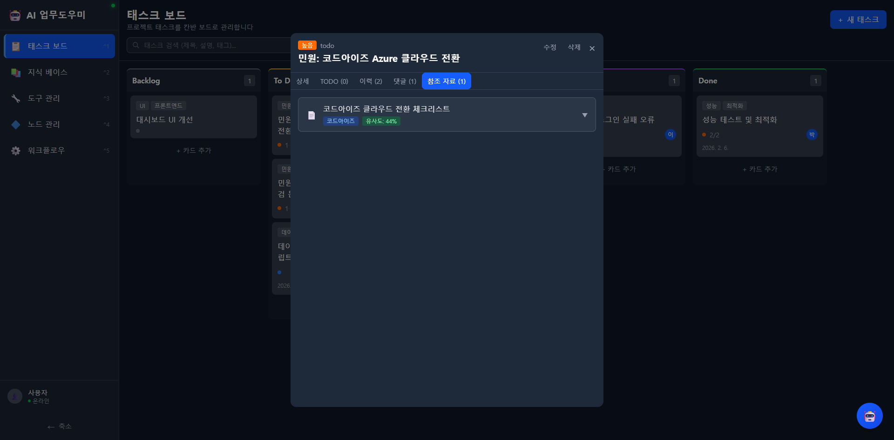

# 사용자 시나리오

AI 업무도우미의 핵심 사용 흐름을 시나리오별로 정리합니다. 각 시나리오는 **사용자 입력 → AI 처리 → 결과 확인** 순서로 구성됩니다.

---

## 시나리오 1: 보안 취약점 점검 민원 처리

### 상황
고객사에서 코드아이즈 보안 취약점 점검 결과에 대한 문의 메일이 도착했습니다. 담당자는 AI 어시스턴트를 활용하여 민원 태스크를 자동 생성하고, 지식 베이스를 참조한 답변 댓글까지 한 번에 처리합니다.

### Step 1. AI 어시스턴트에 민원 내용 전달

**사용자 입력:**
> "고객사에서 코드아이즈 보안 취약점 점검 관련 문의가 왔습니다. 지식 베이스를 참조해서 답변 댓글을 포함한 민원 태스크를 생성해주세요."

AI 어시스턴트가 메시지를 분석하여 다음 작업을 자동으로 수행합니다:
1. 지식 베이스에서 관련 문서를 벡터 유사도 검색
2. 검색된 지식을 기반으로 민원 태스크 생성
3. 참조 문서를 활용하여 답변 댓글 자동 작성



### Step 2. 생성된 태스크 확인

AI가 자동으로 생성한 태스크가 칸반 보드의 **To Do** 컬럼에 즉시 나타납니다.

- **제목**: 민원: 코드아이즈 보안 취약점 점검 문의
- **우선순위**: 높음
- **태그**: 민원, 코드아이즈



### Step 3. AI 추론 근거 확인 (이력 탭)

**이력** 탭에서 AI가 어떤 지식 문서를 참조했는지 투명하게 확인할 수 있습니다.

- **검색 카테고리**: 전체
- **참조 지식 문서**:
  - 코드아이즈 민원 응대 가이드 (유사도: 57%)
  - 코드아이즈 서비스 개요 (유사도: 37%)
  - 코드아이즈 보안 취약점 점검 규칙 (유사도: 34%)
- **자동 댓글 생성**: 예



### Step 4. AI 자동 생성 댓글 확인 (댓글 탭)

**댓글** 탭에서 AI가 지식 베이스를 기반으로 작성한 답변을 확인할 수 있습니다. 마크다운 형식으로 렌더링되어 번호 리스트, 볼드 등이 깔끔하게 표시됩니다.

**AI가 작성한 답변 요약:**
1. 코드아이즈 지원 언어 목록 안내 (Java, C, C++, C#, Python, JavaScript)
2. 미지원 언어 사용 시 수집 파일 수가 적은 것은 정상 동작임을 안내
3. 지원 언어 사용 중 이상이 있는 경우 기술지원팀 에스컬레이션 안내



### Step 5. 참조 자료 확인 (참조 자료 탭)

**참조 자료** 탭에서 AI가 답변 작성에 활용한 원본 지식 문서를 확인할 수 있습니다. 각 문서는 아코디언 형태로 펼쳐서 전체 내용을 볼 수 있습니다.



문서를 클릭하면 원본 내용이 마크다운으로 렌더링되어 표시됩니다:



### 시나리오 1 요약

| 단계 | 사용자 행동 | 시스템 결과 |
|------|-----------|-----------|
| 1 | AI 채팅에 민원 내용 입력 | 지식 베이스 유사도 검색 수행 |
| 2 | (자동) | 민원 태스크 생성 + To Do 컬럼에 배치 |
| 3 | (자동) | 참조 문서 기반 답변 댓글 자동 작성 |
| 4 | 태스크 클릭하여 상세 확인 | 이력/댓글/참조 자료 모두 확인 가능 |

---

## 시나리오 2: Azure 클라우드 전환 요청 처리

### 상황
고객사에서 코드아이즈를 Azure 클라우드 환경으로 전환하고 싶다는 요청이 접수되었습니다. 담당자는 AI 어시스턴트를 통해 전환 절차와 체크리스트를 포함한 태스크를 생성합니다.

### Step 1. AI 어시스턴트에 전환 요청 전달

**사용자 입력:**
> "고객사에서 코드아이즈를 Azure 클라우드 환경으로 전환하고 싶다는 메일이 왔습니다. 전환 절차와 체크리스트를 포함한 태스크를 생성하고, 지식 베이스를 참조하여 안내 댓글도 달아주세요."

### Step 2. 생성된 태스크 확인

AI가 자동 생성한 태스크가 칸반 보드에 나타납니다.

- **제목**: 민원: 코드아이즈 Azure 클라우드 전환
- **설명**: 전환 절차와 체크리스트를 포함한 상세 내용
- **태그**: 민원, 코드아이즈



### Step 3. AI 자동 생성 댓글 확인

AI가 지식 베이스의 "코드아이즈 클라우드 전환 체크리스트" 문서를 참조하여 상세한 전환 가이드를 자동 작성합니다.

**댓글에 포함된 내용:**
- **전환 절차** (6단계): 사전 준비 → 환경 설정 → 코드/데이터 마이그레이션 → 아키텍처 변경 → 테스트/검증 → 운영 전환
- **체크리스트 테이블** (AS-IS → TO-BE): 인프라, JDK, WAS, DB, 아키텍처 등 항목별 전환 내용
- **주의사항**: JDK 메이저 버전 점프, 이기종 DB 전환 쿼리 재작성 등



댓글 하단에는 AS-IS/TO-BE 비교 테이블이 마크다운으로 깔끔하게 렌더링됩니다:



### Step 4. 참조 자료 확인

AI가 답변에 참조한 지식 문서 목록을 확인할 수 있습니다.

- 코드아이즈 클라우드 전환 체크리스트 (유사도: 44%)



### 시나리오 2 요약

| 단계 | 사용자 행동 | 시스템 결과 |
|------|-----------|-----------|
| 1 | AI 채팅에 전환 요청 내용 입력 | 지식 베이스에서 클라우드 전환 문서 검색 |
| 2 | (자동) | 민원 태스크 생성 + 상세 설명 포함 |
| 3 | (자동) | 전환 절차 + 체크리스트 테이블 + 주의사항 포함 댓글 자동 작성 |
| 4 | 태스크 클릭하여 확인 | 댓글 마크다운 렌더링 (목록, 테이블, 볼드) 확인 |

---

## 핵심 포인트

### AI 자동화 흐름

```
사용자 메시지 입력
    ↓
AI가 의도 분석 (민원, 질문, 업무 요청 등)
    ↓
지식 베이스 벡터 유사도 검색 (RAG)
    ↓
태스크 자동 생성 (제목, 설명, 태그, 우선순위)
    ↓
참조 문서 기반 답변 댓글 자동 작성
    ↓
참조 자료 목록 태스크에 첨부
    ↓
칸반 보드 실시간 업데이트
```

### AI 추론 투명성

모든 AI 생성 태스크에는 다음 정보가 자동으로 기록됩니다:

- **이력 탭**: AI가 어떤 지식 문서를 몇 % 유사도로 참조했는지 표시
- **댓글 탭**: 참조 문서 기반으로 생성된 답변 (마크다운 렌더링)
- **참조 자료 탭**: 원본 지식 문서 전문을 아코디언 형태로 열람 가능

이를 통해 AI의 판단 근거를 투명하게 확인하고, 필요 시 담당자가 내용을 수정하거나 보완할 수 있습니다.
